# How OpsMind Works — A Beginner-Friendly Guide

This guide explains the complete OpsMind project in plain language. It also gives practical commands that prove Spring Boot, Kafka, Redis, PostgreSQL, React, JWT authentication, alert detection, incident creation, and AI-assisted analysis are actually working.

---

## 1. What OpsMind Does

OpsMind is an incident-response platform.

Applications send operational logs to OpsMind. OpsMind receives those logs, moves them through Kafka, stores them in PostgreSQL, checks them against alert rules, uses Redis to prevent duplicate alerts, and creates incidents for engineers to investigate.

In simple terms:

```text
Your application reports a problem
                 ↓
OpsMind receives the log
                 ↓
Kafka safely carries the log to a processor
                 ↓
PostgreSQL stores the log permanently
                 ↓
The alert engine checks configured rules
                 ↓
Redis stops repeated alerts from creating noise
                 ↓
OpsMind creates an alert and incident
                 ↓
An engineer investigates and resolves it in React
```

---

## 2. The Main Technologies in Layman Terms

| Technology | Simple analogy | What it does in OpsMind |
|---|---|---|
| React | The control-room screens | Shows dashboards, logs, alerts, incidents, and forms |
| Spring Boot | The control-room staff | Receives requests, checks rules, manages users, and performs business logic |
| Kafka | A reliable conveyor belt | Carries log events from ingestion to background processing |
| PostgreSQL | The official filing cabinet | Permanently stores users, services, logs, rules, alerts, and incidents |
| Redis | A very fast temporary notepad | Remembers recent alert fingerprints so duplicate alerts are suppressed |
| JWT | A signed access pass | Proves who the user is and what they are allowed to do |
| Docker Compose | A building manager | Starts and connects all five application containers |
| Flyway | A database construction plan | Creates and upgrades database tables in a repeatable way |
| Local AI analyzer | An investigation assistant | Summarizes evidence and suggests a possible cause |

### Kafka and Redis are not the same

Kafka transports events. Redis stores small pieces of temporary state.

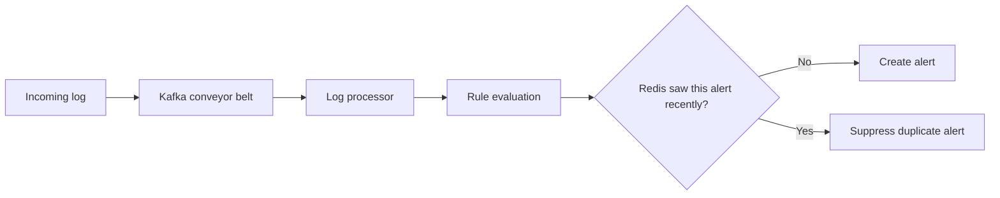

Kafka answers: **“How does the event travel safely?”**

Redis answers: **“Have I recently created this same alert?”**

---

## 3. Complete Architecture

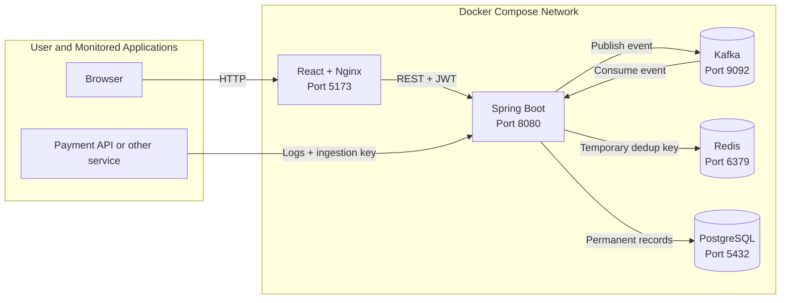

### Container responsibilities

| Container | Image/application | Port | Responsibility |
|---|---|---:|---|
| `infrastructure-frontend-1` | React served by Nginx | 5173 | Browser interface |
| `infrastructure-backend-1` | Spring Boot | 8080 | APIs and business logic |
| `infrastructure-kafka-1` | Apache Kafka | 9092 | Event transport |
| `infrastructure-redis-1` | Redis | 6379 | Alert deduplication |
| `infrastructure-postgres-1` | PostgreSQL | 5432 | Permanent data |

---

## 4. What Happens When You Send a Log

The ingestion endpoint is:

```text
POST http://localhost:8080/api/v1/ingestion/logs
```

The request must contain:

```text
X-OpsMind-Key: the registered service's ingestion key
Content-Type: application/json
```

### Detailed request flow

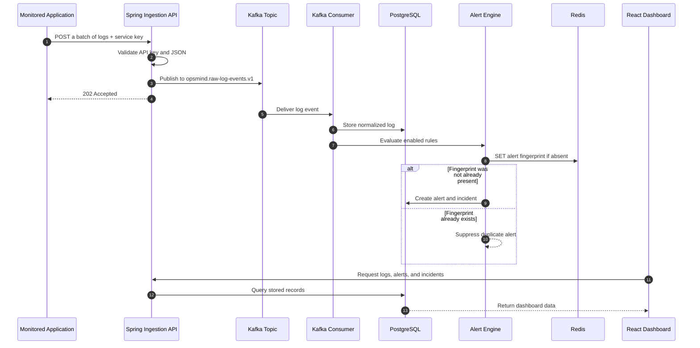

### Why the API returns `202 Accepted`

`202 Accepted` means the backend accepted the log and published it for background processing. It does not mean every later step finished before the response arrived.

Kafka processes the event shortly afterward. This keeps the ingestion API fast even when many applications are sending logs.

---

## 5. Docker Mode Versus Local Mode

This distinction is important when demonstrating Kafka and Redis.

### Docker production profile

Docker Compose sets:

```text
SPRING_PROFILES_ACTIVE=production
```

The production profile selects:

```text
Messaging mode: Kafka
Deduplication mode: Redis
Database: PostgreSQL
```

### Local default profile

Running Spring Boot without the production profile selects:

```text
Messaging mode: Local Java method call
Deduplication mode: Local in-memory map
Database: H2 in-memory database
```

The local profile is convenient for tests, but it does **not** prove that the real Kafka/Redis topology works. Use the Docker environment for that demonstration.

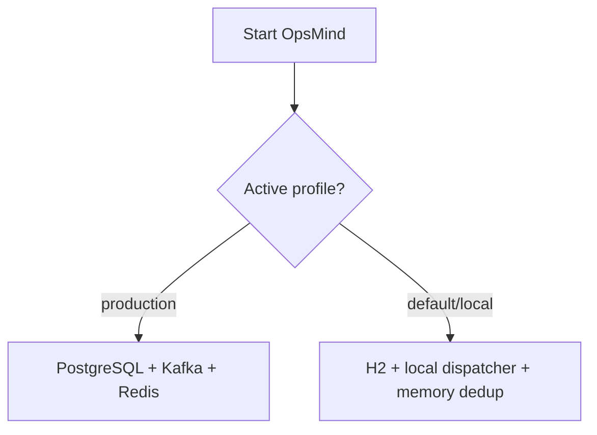

---

## 6. First: Make Docker Commands Easy to Run

Open PowerShell and go to the repository:

```powershell
cd "D:\ai power dashboard"
```

If the `docker` command works normally, use it directly.

If PowerShell says Docker is not recognized, define the full path once:

```powershell
$docker = "$env:LOCALAPPDATA\Programs\DockerDesktop\resources\bin\docker.exe"
```

Then replace commands such as:

```powershell
docker compose version
```

with:

```powershell
& $docker compose version
```

The rest of this document uses `docker`. Use `& $docker` instead if required on your machine.

---

## 7. Prove All Containers Are Running

Run:

```powershell
docker compose -f infrastructure/docker-compose.yml --profile app ps
```

Expected result:

```text
backend    Up ... (healthy)
frontend   Up ...
kafka      Up ... (healthy)
postgres   Up ... (healthy)
redis      Up ... (healthy)
```

### What this proves

- Docker created all containers.
- Health checks for Spring Boot, Kafka, Redis, and PostgreSQL passed.
- It does not yet prove the complete log flow. The following sections prove that.

---

## 8. Prove Spring Boot Is Working

### Check application health

```powershell
Invoke-RestMethod http://localhost:8080/actuator/health
```

Expected:

```json
{
  "status": "UP"
}
```

### Prove the production profile is active

```powershell
docker logs infrastructure-backend-1 2>&1 |
    Select-String 'profile is active|Started OpsMindApplication'
```

Look for:

```text
The following 1 profile is active: "production"
Started OpsMindApplication
```

### Check backend errors

```powershell
docker logs infrastructure-backend-1 --since 10m 2>&1 |
    Select-String 'ERROR'
```

No output means no backend `ERROR` log was produced in the last ten minutes.

---

## 9. Prove the React Frontend Is Working

Run:

```powershell
(Invoke-WebRequest http://localhost:5173 -UseBasicParsing).StatusCode
```

Expected:

```text
200
```

Then open:

```text
http://localhost:5173
```

If login, navigation, forms, and data tables work, React and the Nginx reverse proxy are working.

---

## 10. Prove PostgreSQL Is Working

### Ask PostgreSQL if it is ready

```powershell
docker exec infrastructure-postgres-1 pg_isready -U opsmind -d opsmind
```

Expected:

```text
/var/run/postgresql:5432 - accepting connections
```

### List OpsMind tables

```powershell
docker exec infrastructure-postgres-1 psql `
    -U opsmind `
    -d opsmind `
    -c "\dt"
```

You should see tables such as:

```text
app_user
monitored_service
log_event
alert_rule
alert
incident
incident_note
timeline_event
ai_analysis
flyway_schema_history
```

### Count the stored records

```powershell
docker exec infrastructure-postgres-1 psql `
    -U opsmind `
    -d opsmind `
    -c "SELECT
        (SELECT COUNT(*) FROM monitored_service) AS services,
        (SELECT COUNT(*) FROM log_event) AS logs,
        (SELECT COUNT(*) FROM alert_rule) AS rules,
        (SELECT COUNT(*) FROM alert) AS alerts,
        (SELECT COUNT(*) FROM incident) AS incidents;"
```

### Show the five latest logs

```powershell
docker exec infrastructure-postgres-1 psql `
    -U opsmind `
    -d opsmind `
    -c "SELECT external_event_id, level, message, trace_id, occurred_at
        FROM log_event
        ORDER BY occurred_at DESC
        LIMIT 5;"
```

### What this proves

- Flyway created the schema.
- Kafka-consumed events became permanent database rows.
- The dashboard is reading real stored data rather than hard-coded UI data.

---

## 11. Prove Kafka Is Working

OpsMind uses this Kafka topic:

```text
opsmind.raw-log-events.v1
```

The producer is `KafkaIngestionDispatcher`.

The consumer group is:

```text
opsmind-log-processor
```

### Step 1: Ask Kafka for its topics

```powershell
docker exec infrastructure-kafka-1 `
    /opt/kafka/bin/kafka-topics.sh `
    --bootstrap-server localhost:9092 `
    --list
```

Expected topic:

```text
opsmind.raw-log-events.v1
```

If the topic does not appear before the first log is sent, send one log and run the command again. Auto-topic creation is enabled in this development setup.

### Step 2: Describe the topic

```powershell
docker exec infrastructure-kafka-1 `
    /opt/kafka/bin/kafka-topics.sh `
    --bootstrap-server localhost:9092 `
    --describe `
    --topic opsmind.raw-log-events.v1
```

This shows its partitions, leader, replicas, and in-sync replicas.

### Step 3: Inspect the consumer group

```powershell
docker exec infrastructure-kafka-1 `
    /opt/kafka/bin/kafka-consumer-groups.sh `
    --bootstrap-server localhost:9092 `
    --describe `
    --group opsmind-log-processor
```

Important columns:

| Column | Meaning |
|---|---|
| `CURRENT-OFFSET` | How many records the OpsMind consumer has processed |
| `LOG-END-OFFSET` | How many records Kafka currently has |
| `LAG` | Records waiting to be processed |

For a healthy, quiet demo system, `LAG` should normally return to `0`.

### Step 4: Send a uniquely identifiable event

Use the ingestion key from the Services page:

```powershell
$opsMindKey = "PASTE_YOUR_SERVICE_KEY"
$proofId = "kafka-proof-$([guid]::NewGuid().ToString('N'))"

$payload = @(
    @{
        eventId = $proofId
        occurredAt = (Get-Date).ToUniversalTime().ToString("o")
        level = "INFO"
        message = "Kafka end-to-end proof event"
        traceId = $proofId
        host = "proof-client"
        attributes = @{
            test = "kafka-proof"
        }
    }
)

Invoke-RestMethod `
    -Method Post `
    -Uri "http://localhost:8080/api/v1/ingestion/logs" `
    -Headers @{"X-OpsMind-Key" = $opsMindKey} `
    -ContentType "application/json" `
    -Body (ConvertTo-Json -InputObject $payload -Depth 5)
```

Wait one second:

```powershell
Start-Sleep -Seconds 1
```

Prove PostgreSQL received the Kafka-consumed event:

```powershell
docker exec infrastructure-postgres-1 psql `
    -U opsmind `
    -d opsmind `
    -c "SELECT external_event_id, level, message
        FROM log_event
        WHERE external_event_id = '$proofId';"
```

### Strong Kafka proof

The following combination is strong evidence:

1. The ingestion API returned `202 Accepted`.
2. Kafka topic end offset increased.
3. Consumer group offset increased.
4. Consumer lag returned to zero.
5. The exact event appeared in PostgreSQL and Live Logs.

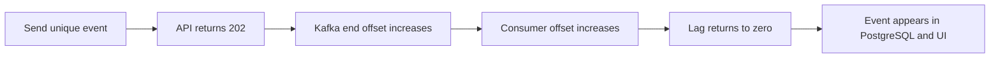

That is much stronger than showing only that the Kafka container is running.

---

## 12. Prove Redis Is Working

Redis stores keys that look like:

```text
alert:dedup:<fingerprint>
```

The key value is `1`, and the key automatically expires after the rule's configured deduplication period.

### Step 1: Ping Redis

```powershell
docker exec infrastructure-redis-1 redis-cli PING
```

Expected:

```text
PONG
```

### Step 2: Send a log that matches an enabled alert rule

For example, if the rule keyword is `connection timed out`:

```powershell
Send-OpsMindLog `
    -Level ERROR `
    -Message "Database connection timed out"
```

### Step 3: List Redis deduplication keys

```powershell
docker exec infrastructure-redis-1 `
    redis-cli --scan --pattern "alert:dedup:*"
```

At least one `alert:dedup:` key should appear after a matching rule creates an alert.

### Step 4: Inspect a key and its expiry time

```powershell
$redisKey = docker exec infrastructure-redis-1 `
    redis-cli --scan --pattern "alert:dedup:*" |
    Select-Object -First 1

docker exec infrastructure-redis-1 redis-cli GET $redisKey
docker exec infrastructure-redis-1 redis-cli TTL $redisKey
```

Expected:

```text
1
some positive number of seconds
```

### Step 5: Prove deduplication behavior

Send the same matching message twice with different event IDs:

```powershell
Send-OpsMindLog -Level ERROR -Message "Database connection timed out"
Send-OpsMindLog -Level ERROR -Message "Database connection timed out"
```

What should happen during the deduplication window:

```text
Two log rows are stored
One alert is created
One incident is created
One Redis deduplication key exists
```

This is the most understandable Redis demonstration.

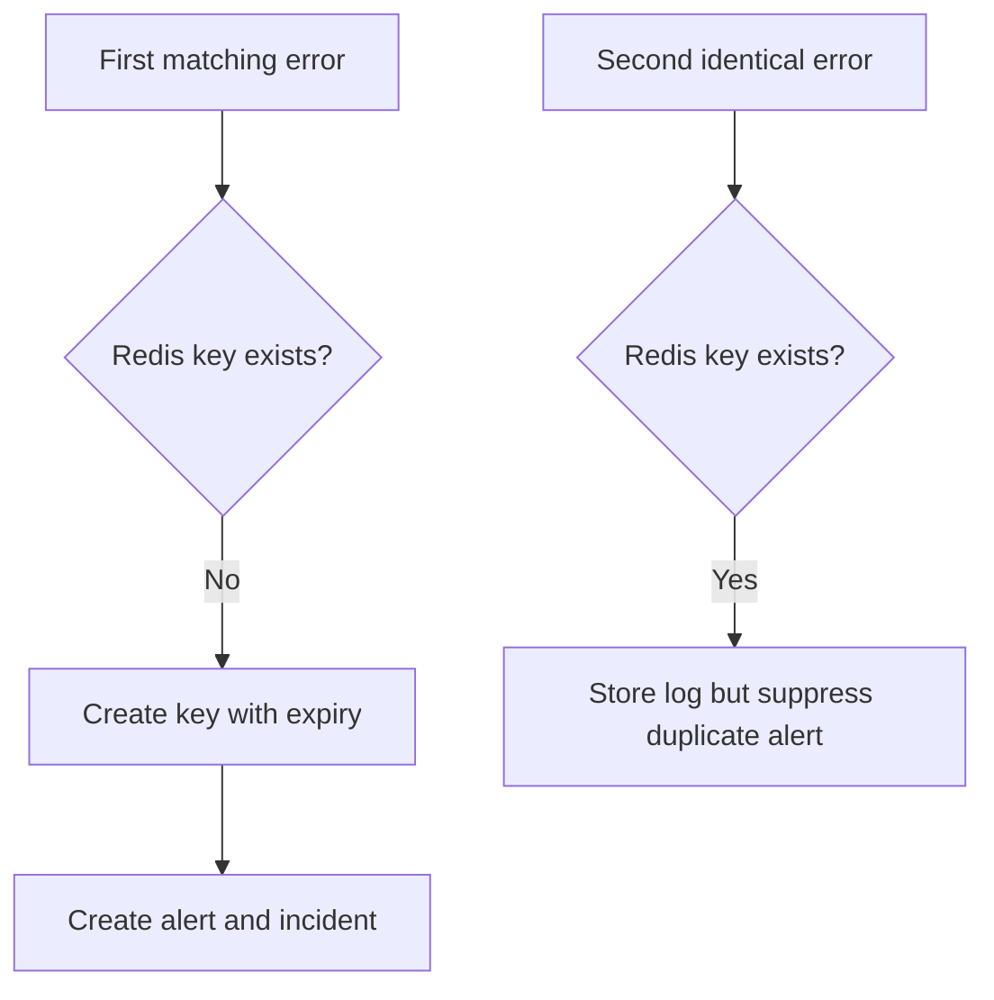

### Why the Redis key disappears later

Redis keys have a time-to-live, or TTL. When the TTL reaches zero, Redis removes the key automatically. A future matching problem can then create a new alert.

---

## 13. Prove Alert Rules Are Working

### Keyword rule

Example rule:

```text
Type: KEYWORD
Keyword: connection timed out
Severity: SEV2
Deduplication: 300 seconds
```

This log matches:

```text
Database connection timed out while processing payment
```

This log does not match:

```text
Payment completed successfully
```

### Count-threshold rule

Example:

```text
Type: COUNT_THRESHOLD
Threshold: 5
Window: 60 seconds
Severity: SEV2
```

OpsMind counts recent `ERROR` logs for the service. When the count reaches the configured threshold, it creates an alert if Redis allows the fingerprint.

### Database proof

```powershell
docker exec infrastructure-postgres-1 psql `
    -U opsmind `
    -d opsmind `
    -c "SELECT r.name, r.rule_type, r.keyword, a.severity,
               a.summary, a.triggered_at
        FROM alert a
        JOIN alert_rule r ON r.id = a.rule_id
        ORDER BY a.triggered_at DESC
        LIMIT 10;"
```

---

## 14. How an Alert Becomes an Incident

An alert is a detected signal. An incident is the human response record.

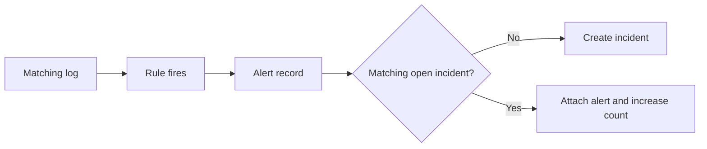

OpsMind creates a fingerprint using information such as the service, rule, and normalized message. The fingerprint helps identify repeated versions of the same problem.

### Incident lifecycle

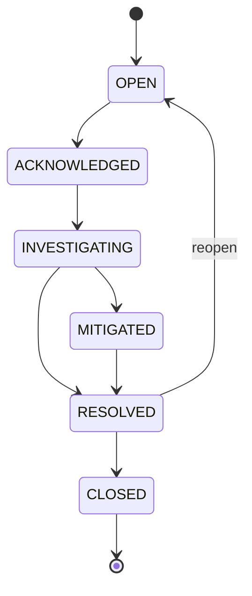

Each change creates a timeline event so the investigation is auditable.

---

## 15. Prove JWT Authentication Is Working

### Log in and receive tokens

```powershell
$login = Invoke-RestMethod `
    -Method Post `
    -Uri "http://localhost:8080/api/v1/auth/login" `
    -ContentType "application/json" `
    -Body (@{
        email = "docker-admin@opsmind.local"
        password = "DockerAdmin123!"
    } | ConvertTo-Json)

$login.user
```

Expected role:

```text
ADMIN
```

### Call a protected endpoint with the JWT

```powershell
$headers = @{
    Authorization = "Bearer $($login.accessToken)"
}

Invoke-RestMethod `
    -Uri "http://localhost:8080/api/v1/dashboard/summary" `
    -Headers $headers
```

### Prove access is blocked without a JWT

```powershell
try {
    Invoke-RestMethod "http://localhost:8080/api/v1/incidents"
} catch {
    $_.Exception.Response.StatusCode.value__
}
```

Expected:

```text
401
```

This proves the protected API requires authentication.

---

## 16. What the AI Analysis Currently Does

The current project includes a local evidence-based analyzer. It does not require an external AI key.

It:

1. Loads the incident.
2. Loads related alerts.
3. Loads recent service logs.
4. Selects a strong recent error signal.
5. Redacts common secret patterns.
6. Produces a summary, hypothesis, confidence level, and next checks.
7. Saves the result and adds a timeline event.

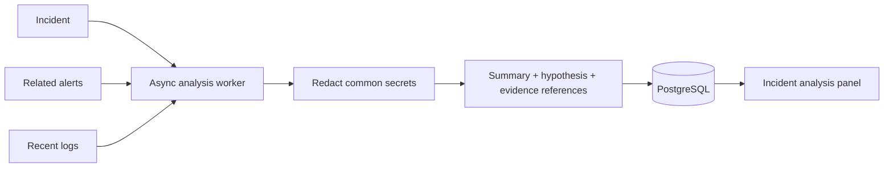

### Important limitation

This is currently a deterministic local analyzer, not a hosted LLM such as an OpenAI model. It demonstrates the asynchronous job, evidence retrieval, redaction, storage, and UI workflow. A real model adapter can be added later.

---

## 17. Where Each Type of Data Lives

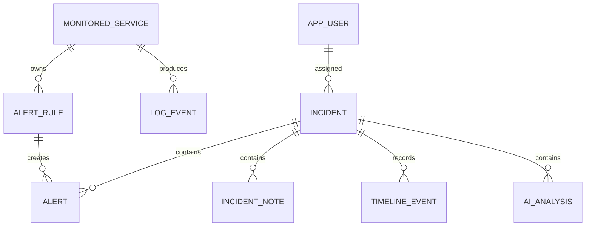

| Data | Storage | Why |
|---|---|---|
| Users | PostgreSQL | Must persist |
| Refresh tokens | PostgreSQL, hashed | Must support rotation/revocation |
| Services and API-key hashes | PostgreSQL | Must persist securely |
| Logs | PostgreSQL | Searchable recent history |
| Alert rules | PostgreSQL | Configuration must persist |
| Alerts and incidents | PostgreSQL | Official operational records |
| Incident notes and timeline | PostgreSQL | Audit trail |
| Analysis results | PostgreSQL | Investigation history |
| Raw event transport | Kafka | Asynchronous, replayable pipeline |
| Recent alert fingerprint | Redis | Fast temporary deduplication |

---

## 18. Complete Demonstration Script

This is a practical interview/demo sequence.

### Step 1: Show containers

```powershell
docker compose -f infrastructure/docker-compose.yml --profile app ps
```

### Step 2: Show Kafka and Redis

```powershell
docker exec infrastructure-kafka-1 `
    /opt/kafka/bin/kafka-topics.sh `
    --bootstrap-server localhost:9092 --list

docker exec infrastructure-redis-1 redis-cli PING
```

### Step 3: Open the dashboard

```text
http://localhost:5173
```

### Step 4: Register a service

Create `payment-api` in the Services page and copy its one-time key.

### Step 5: Create one alert rule

```text
Name: Payment database timeout
Type: Keyword match
Keyword: connection timed out
Severity: SEV2
Window: 300 seconds
Deduplication: 300 seconds
```

### Step 6: Send a matching error

```powershell
Send-OpsMindLog `
    -Level ERROR `
    -Message "Database connection timed out"
```

### Step 7: Prove the pipeline

Show:

1. The event under Live Logs.
2. The new alert under Alerts.
3. The new incident under Incidents.
4. The Redis dedup key.
5. Kafka consumer lag at zero.
6. The PostgreSQL rows.

### Step 8: Handle the incident

1. Acknowledge it.
2. Mark it investigating.
3. Add an investigation note.
4. Run AI analysis.
5. Mark it mitigated.
6. Resolve it with a resolution summary.
7. Show the complete incident timeline.

---

## 19. Evidence Checklist

Use this table when explaining the project to an interviewer.

| Claim | Proof to show |
|---|---|
| Docker topology works | `docker compose ps` shows healthy containers |
| Spring Boot works | Actuator returns `UP` |
| Production mode is active | Backend log names the `production` profile |
| React works | Frontend returns HTTP 200 and renders data |
| PostgreSQL works | SQL query shows stored log/alert/incident rows |
| Kafka works | Topic exists, offsets increase, lag returns to zero, event reaches PostgreSQL |
| Kafka consumer works | `opsmind-log-processor` group has a current offset |
| Redis works | `PING` returns `PONG` and `alert:dedup:*` key has positive TTL |
| Deduplication works | Two matching logs create one alert inside the TTL |
| JWT works | Protected request succeeds with token and fails with 401 without token |
| Rule engine works | Matching message creates an alert; non-matching message does not |
| Incident workflow works | Status changes and timeline records appear |
| AI job works | Analysis changes from queued to completed and stores evidence-based output |

---

## 20. Common Questions and Answers

### “Why not save the log directly without Kafka?”

Kafka separates the fast ingestion API from slower background processing. If log traffic grows, Kafka acts as a buffer and multiple consumers can process events independently.

### “Why is Redis needed if PostgreSQL already exists?”

PostgreSQL is the permanent source of truth. Redis is better for very fast, short-lived checks such as “has this alert fingerprint appeared during the last five minutes?”

### “What happens if the same event is delivered twice?”

The external `eventId` is used for idempotency. OpsMind returns the already stored event instead of creating a second log row.

### “What happens if the same error message repeats?”

Each unique event can still be stored as a log, but Redis prevents repeated matching errors from creating alert noise during the configured deduplication period.

### “Why can I see a log but no alert?”

Possible reasons:

- No rule exists for that service.
- The rule is disabled.
- The keyword does not match the message.
- The count threshold was not reached.
- Redis is still suppressing the same alert fingerprint.

### “Why can I see an alert but no new incident?”

The alert may have been correlated with an existing open incident. Check the alert's incident link and the incident's alert count.

### “Does the UI update automatically?”

The current UI has refresh controls and reloads after mutations. Fully live push updates using WebSockets or Server-Sent Events would be a valuable future enhancement.

---

## 21. Troubleshooting Flow

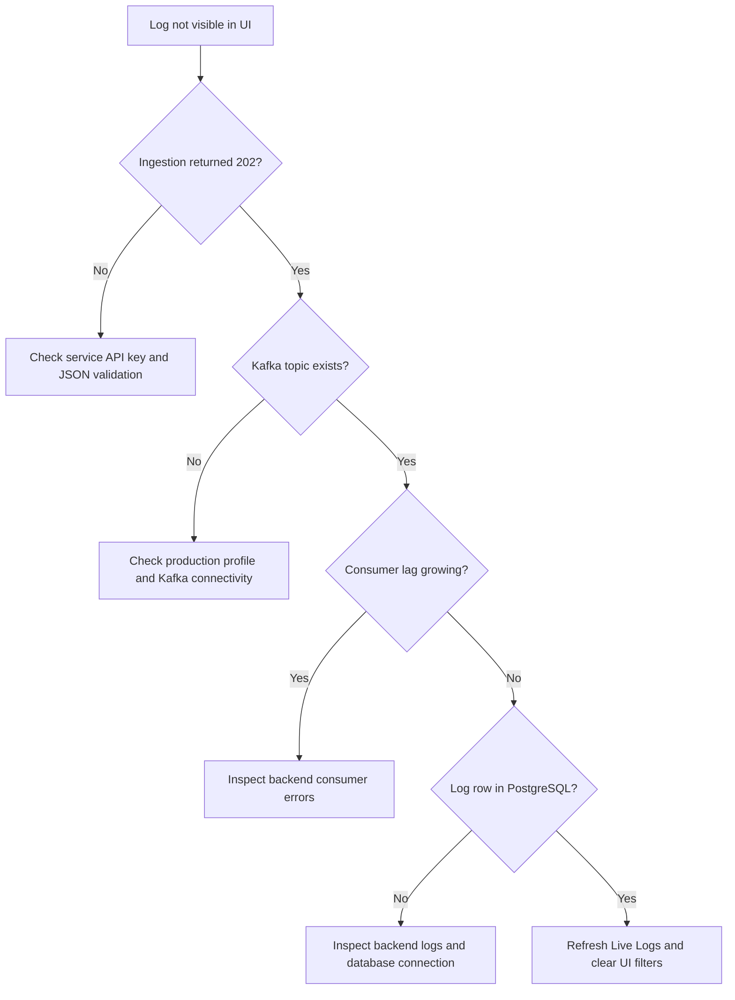

### View all recent backend logs

```powershell
docker logs infrastructure-backend-1 --since 10m
```

### View Kafka logs

```powershell
docker logs infrastructure-kafka-1 --since 10m
```

### View Redis logs

```powershell
docker logs infrastructure-redis-1 --since 10m
```

### View PostgreSQL logs

```powershell
docker logs infrastructure-postgres-1 --since 10m
```

---

## 22. What Is Implemented and What Is Future Work

### Implemented

- Dockerized React, Spring Boot, Kafka, Redis, and PostgreSQL
- JWT login and role-based access
- Service registration and hashed ingestion keys
- Kafka-based log ingestion
- Idempotent event handling
- PostgreSQL log persistence
- Keyword and error-count alert rules
- Redis alert deduplication with TTL
- Automatic alert and incident creation
- Incident lifecycle, notes, and timeline
- Asynchronous local evidence analysis
- Searchable/filterable dashboard pages
- Flyway database migrations
- Backend integration tests and frontend tests

### Valuable future work

- Server-Sent Events or WebSockets for automatic live updates
- Dead-letter Kafka topics and an operator UI for failed records
- OpenTelemetry metrics and trace ingestion
- Email, Slack, or PagerDuty notifications
- Heartbeats and availability checks
- Deployment-event correlation
- A hosted LLM adapter with structured output
- Similar-incident search using embeddings
- Multi-organization tenancy
- Long-term log storage in OpenSearch or ClickHouse
- MTTA/MTTR and incident-trend analytics

---

## 23. One-Minute Interview Explanation

> OpsMind is an incident-response platform built with Spring Boot and React. Applications authenticate with a service-specific ingestion key and send log batches to a REST endpoint. In the production Docker profile, Spring publishes each normalized log to Kafka and immediately returns 202. A consumer group processes the event asynchronously, persists it in PostgreSQL, and evaluates deterministic alert rules. Redis stores alert fingerprints with a TTL to suppress duplicate alert noise. Matching alerts are correlated into incidents with a controlled lifecycle, notes, and an audit timeline. JWT secures user APIs, and an asynchronous evidence worker produces a redacted root-cause hypothesis. I verify the architecture using Kafka offsets and consumer lag, Redis dedup keys and TTLs, PostgreSQL queries, health endpoints, and end-to-end integration tests.

---

## 24. Final Mental Model

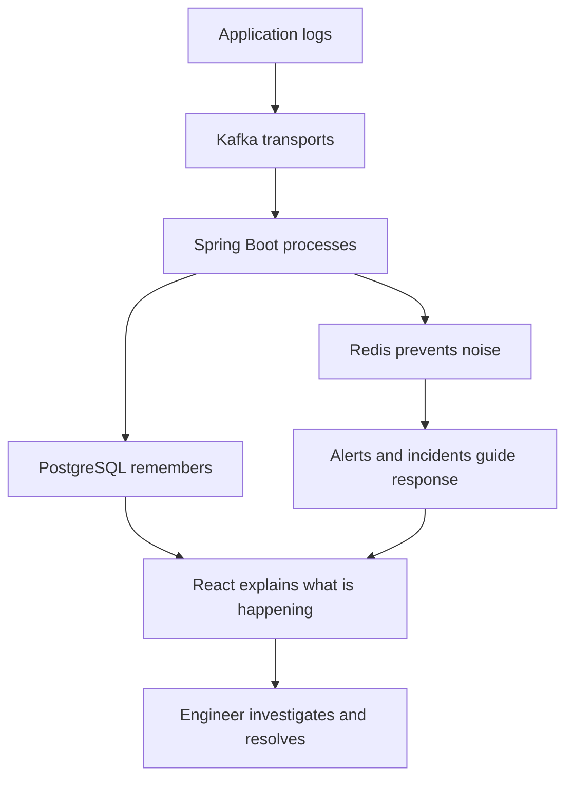

Remember these five sentences:

1. **Kafka moves the events.**
2. **PostgreSQL keeps the official records.**
3. **Redis stops duplicate alert noise.**
4. **Spring Boot applies the rules and workflow.**
5. **React helps the engineer understand and act.**

