# OpsMind — Complete Concepts and Interview Handbook

> A professional, interview-ready guide to explaining the OpsMind AI-powered incident-response platform from end to end.

---

## Table of contents

1. [How to use this handbook](#1-how-to-use-this-handbook)
2. [Project summary and interview introductions](#2-project-summary-and-interview-introductions)
3. [The problem OpsMind solves](#3-the-problem-opsmind-solves)
4. [System architecture](#4-system-architecture)
5. [End-to-end request and event flows](#5-end-to-end-request-and-event-flows)
6. [Why event-driven architecture](#6-why-event-driven-architecture)
7. [Kafka from first principles](#7-kafka-from-first-principles)
8. [How Kafka is used inside OpsMind](#8-how-kafka-is-used-inside-opsmind)
9. [Kafka algorithms and delivery guarantees](#9-kafka-algorithms-and-delivery-guarantees)
10. [Kafka versus RabbitMQ and other alternatives](#10-kafka-versus-rabbitmq-and-other-alternatives)
11. [Redis and the alert-deduplication algorithm](#11-redis-and-the-alert-deduplication-algorithm)
12. [Alert detection and incident correlation](#12-alert-detection-and-incident-correlation)
13. [PostgreSQL, JPA, transactions, and locking](#13-postgresql-jpa-transactions-and-locking)
14. [Spring Boot backend concepts](#14-spring-boot-backend-concepts)
15. [JWT, API keys, authentication, and security](#15-jwt-api-keys-authentication-and-security)
16. [React frontend concepts](#16-react-frontend-concepts)
17. [AI-assisted root-cause analysis](#17-ai-assisted-root-cause-analysis)
18. [Docker, configuration, observability, and deployment](#18-docker-configuration-observability-and-deployment)
19. [Testing strategy](#19-testing-strategy)
20. [Scaling and production-hardening plan](#20-scaling-and-production-hardening-plan)
21. [Design decisions, limitations, and honest trade-offs](#21-design-decisions-limitations-and-honest-trade-offs)
22. [Interview question bank with answers and alternate questions](#22-interview-question-bank-with-answers-and-alternate-questions)
23. [System-design scenarios](#23-system-design-scenarios)
24. [Live interview demonstration](#24-live-interview-demonstration)
25. [Rapid revision sheet](#25-rapid-revision-sheet)
26. [Glossary](#26-glossary)

---

## 1. How to use this handbook

Do not memorize every sentence. Understand the journey of one log:

```text
Application -> API key validation -> Kafka -> consumer -> PostgreSQL
            -> rule evaluation -> Redis deduplication -> alert
            -> incident correlation -> AI analysis -> React dashboard
```

For an interview, prepare at three depths:

- **30 seconds:** what the product does and its main technologies.
- **2 minutes:** the complete data flow and the reason for Kafka and Redis.
- **Deep dive:** delivery guarantees, partitioning, deduplication, transactions, failures, security, testing, and scale.

The best answer pattern is:

1. State the requirement.
2. Explain the design choice.
3. Describe the implementation.
4. Mention the trade-off.
5. Explain how you would improve it at production scale.

---

## 2. Project summary and interview introductions

### 2.1 One-line description

OpsMind is an event-driven incident-response platform that ingests service logs, detects alert conditions, correlates related alerts into incidents, and generates evidence-based root-cause guidance for engineers.

### 2.2 Resume-ready description

> Built a full-stack incident-response platform using Java, Spring Boot, React, PostgreSQL, Kafka, Redis, JWT, and Docker. Implemented asynchronous log ingestion, keyword and threshold alerting, atomic Redis-based deduplication, incident correlation, role-based security, and AI-assisted root-cause analysis.

### 2.3 Thirty-second interview pitch

> OpsMind helps engineering teams turn production logs into actionable incidents. Services send logs through an authenticated ingestion API. The backend publishes them to Kafka so ingestion is decoupled from processing. A Kafka consumer persists the logs, evaluates alert rules, uses Redis to suppress repeated alerts, correlates alerts into incidents in PostgreSQL, and triggers asynchronous root-cause analysis. A React dashboard gives operators a single place to investigate services, logs, alerts, incidents, and recommendations.

### 2.4 Two-minute architecture pitch

> I designed OpsMind as a modular, event-driven application. The React client calls secured Spring Boot REST APIs. Human users authenticate with JWT access and refresh tokens, while monitored services ingest logs with scoped API keys. The ingestion endpoint validates a batch and publishes each event to a Kafka topic using the service ID as the record key. This keeps events for the same service ordered within a partition and lets the API respond without running expensive detection work synchronously.
>
> A consumer group processes the Kafka records. The consumer checks the external event ID for idempotency, stores the event in PostgreSQL, loads enabled rules for that service, and evaluates keyword or count-threshold rules. When a rule matches, it creates a stable fingerprint from the service, rule, and normalized message. It then performs Redis `SET if absent` with a TTL. Only the first matching event inside the deduplication window creates an alert; later duplicates are suppressed. Alerts sharing a fingerprint are attached to an open incident, and an asynchronous analyzer produces a probable cause and recommended actions. The dashboard exposes this entire lifecycle.
>
> Kafka provides buffering, replay, ordering within partitions, and independent consumers. Redis provides fast atomic temporary state. PostgreSQL remains the durable source of truth. The current implementation is suitable for a strong portfolio project; for higher scale I would add a schema registry, dead-letter topics, transactional outbox, centralized search storage, metrics, distributed tracing, and high-availability infrastructure.

### 2.5 Main technology responsibilities

| Technology | Responsibility in OpsMind |
|---|---|
| React | Operator dashboard and client-side interaction |
| Spring Boot | REST APIs, business logic, security, consumers, integration |
| Kafka | Durable event stream between ingestion and processing |
| Redis | Atomic short-lived alert deduplication state |
| PostgreSQL | Durable users, services, logs, rules, alerts, incidents, and analysis |
| JWT | Stateless authentication for human users |
| API keys | Machine-to-machine authentication for log producers |
| Flyway | Version-controlled database schema migration |
| Docker Compose | Repeatable local infrastructure and application startup |

---

## 3. The problem OpsMind solves

### 3.1 Real-world problem

Production applications generate large numbers of logs. Engineers cannot manually watch all of them. A useful incident platform must:

- accept events from many services;
- avoid losing bursts of traffic;
- detect meaningful patterns;
- avoid creating thousands of duplicate alerts;
- group related alerts into an incident;
- preserve a searchable history;
- show evidence and next actions;
- control who can access operational data.

### 3.2 Functional requirements

- User registration, login, token refresh, and logout.
- Role-aware access to protected APIs.
- Service registration and API-key generation.
- Batch log ingestion.
- Log browsing and filtering.
- Keyword and count-threshold alert rules.
- Alert deduplication.
- Incident creation, assignment, status, severity, timeline, and notes.
- AI-assisted analysis.
- Operational dashboard.

### 3.3 Non-functional requirements

- **Availability:** ingestion should survive temporary downstream slowness.
- **Scalability:** processing should grow by adding Kafka partitions and consumers.
- **Durability:** incidents and logs must survive restarts.
- **Security:** users and services need separate credentials.
- **Idempotency:** retries must not create duplicate log records.
- **Observability:** operators need health, lag, error, and latency signals.
- **Maintainability:** business responsibilities should be separated into layers.

---

## 4. System architecture

### 4.1 High-level architecture

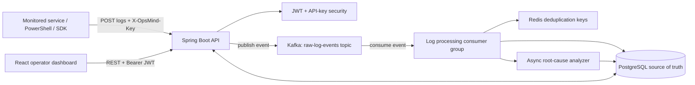

### 4.2 Backend responsibility map

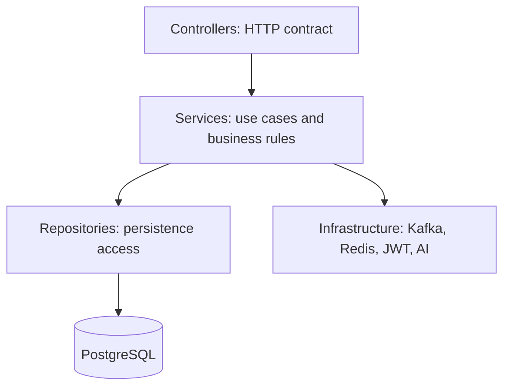

This is a modular monolith: one deployable Spring Boot application with internally separated responsibilities. It avoids early microservice complexity but preserves boundaries that can later be extracted.

### 4.3 Why each data system has a different job

| System | Type of state | Why it fits |
|---|---|---|
| Kafka | Ordered, replayable event stream | Buffers bursts and decouples producers from consumers |
| Redis | Temporary coordination state | Atomic operations with low latency and TTL |
| PostgreSQL | Long-lived relational business data | Transactions, constraints, joins, and durable history |

Kafka, Redis, and PostgreSQL are not duplicates. They solve different problems.

---

## 5. End-to-end request and event flows

### 5.1 Log ingestion to incident creation

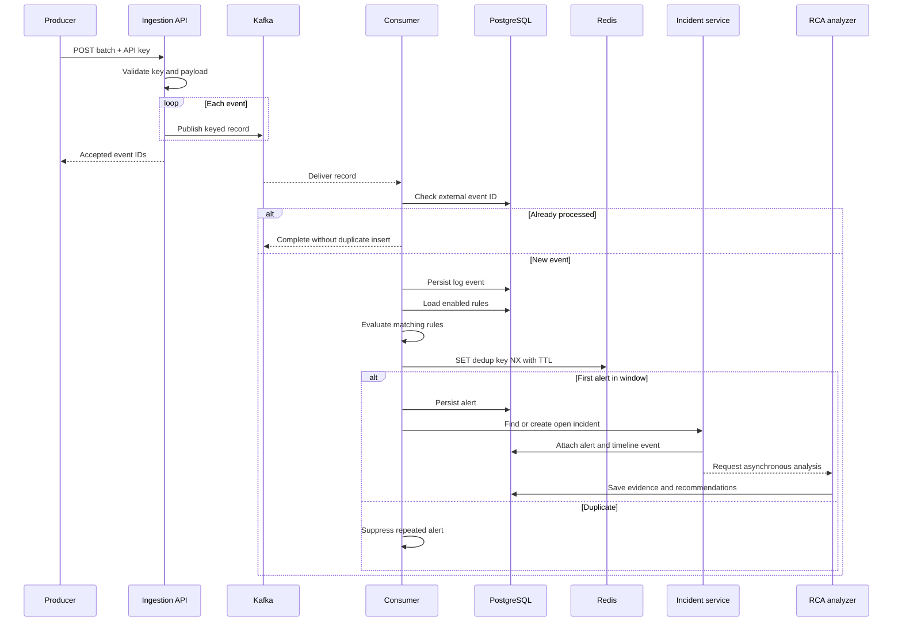

### 5.2 Login flow

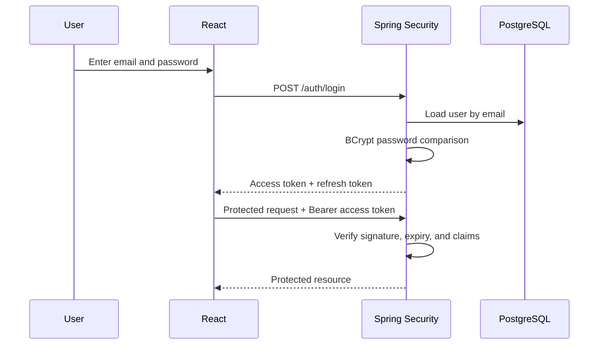

### 5.3 What happens when something fails

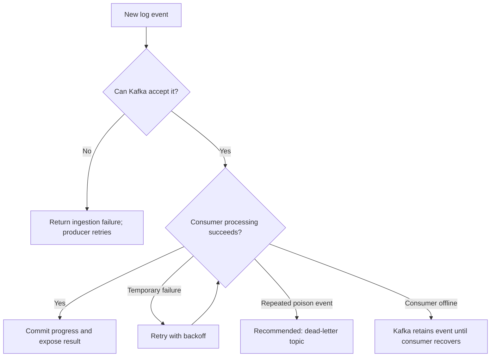

---

## 6. Why event-driven architecture

### 6.1 Synchronous alternative

Without Kafka, the ingestion HTTP request would validate, store, evaluate every rule, deduplicate, create an incident, and run analysis before responding. A slow database or analyzer would directly slow or fail ingestion.

### 6.2 Event-driven design

With Kafka, ingestion and processing are separate stages:

```text
HTTP request -> validate -> publish -> respond
                                  |
                                  v
                         process asynchronously
```

Benefits:

- producers and processors are temporally decoupled;
- Kafka buffers sudden traffic spikes;
- consumers can recover and continue from offsets;
- events can be replayed;
- more independent consumers can be added later;
- ingestion latency is less dependent on rule-processing latency.

Costs:

- eventual consistency;
- more infrastructure;
- duplicates and retries must be handled;
- ordering is scoped to a partition;
- debugging requires correlation IDs and observability.

### 6.3 Eventual consistency in layman terms

The API may acknowledge a log before it appears on the dashboard. The log is safely queued, but the background consumer has not processed it yet. Usually the delay is milliseconds; under load it may be longer. The delay is measured as consumer lag.

---

## 7. Kafka from first principles

### 7.1 What Kafka is

Apache Kafka is a distributed append-only event log. Producers append records to topics; consumers independently read those records using offsets. Kafka normally retains records for a configured period even after they are consumed.

Kafka is more than a traditional queue because the same retained stream can be read by multiple consumer groups and replayed.

### 7.2 Core vocabulary

| Term | Meaning |
|---|---|
| Broker | One Kafka server |
| Cluster | Multiple Kafka brokers working together |
| Topic | Named stream of related events |
| Partition | Ordered append-only shard of a topic |
| Record | Key, value, timestamp, and optional headers |
| Producer | Application that writes records |
| Consumer | Application that reads records |
| Consumer group | Consumers sharing work for a topic |
| Offset | Record position inside a partition |
| Leader | Broker handling reads/writes for a partition |
| Replica | Copy of a partition on another broker |
| ISR | In-sync replicas sufficiently caught up with the leader |
| Retention | How long Kafka keeps records |
| Lag | Difference between latest offset and consumer progress |

### 7.3 Topics, partitions, and ordering

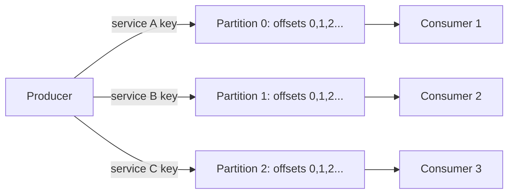

Kafka guarantees order **inside one partition**, not across the complete topic. If two events must stay ordered, route them with the same stable key.

### 7.4 Record-key partitioning algorithm

Conceptually, a keyed record is routed as:

```text
partition = positiveHash(recordKey) mod numberOfPartitions
```

Kafka clients use a deterministic partitioner for keyed records. Java clients have traditionally used Kafka-compatible hashing such as Murmur2 for the default keyed mapping. The interview-safe point is not the exact library function; it is that the same key normally maps to the same partition while the partition count remains unchanged.

For OpsMind:

```text
record key = serviceId
result     = logs from the same service normally enter the same partition
benefit    = per-service ordering
```

Important trade-offs:

- A very busy service can create a hot partition.
- Increasing the topic partition count can change key-to-partition mapping.
- A null key may use sticky or batching-aware distribution depending on the client version.

### 7.5 Consumer groups

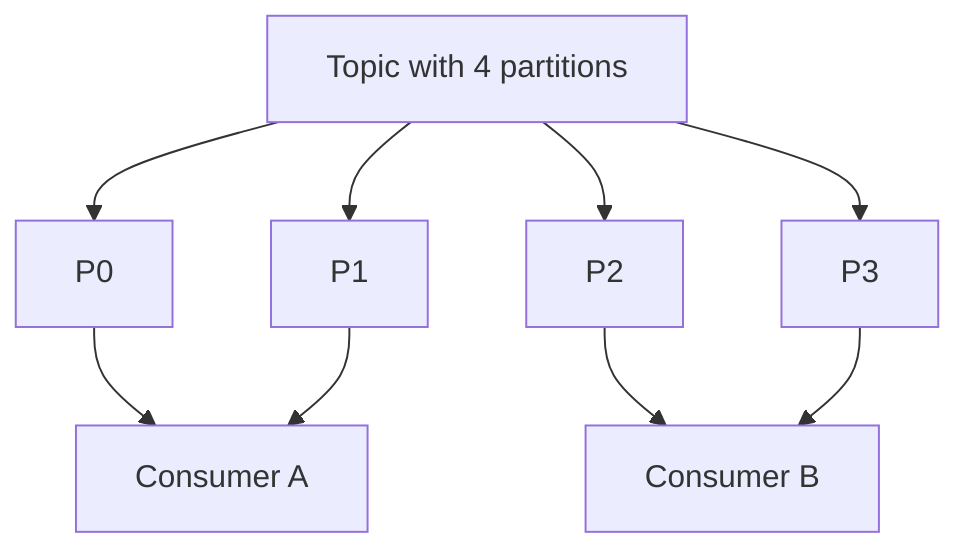

Within one consumer group, a partition is assigned to at most one active consumer at a time. Therefore:

- four partitions and two consumers allow both consumers to work;
- four partitions and four consumers allow up to four-way parallelism;
- four partitions and six consumers leave at least two consumers idle.

Different consumer groups can independently read the same topic. OpsMind could later have separate groups for alerting, analytics, archival, and anomaly detection.

### 7.6 Offsets and commits

An offset identifies a record's position in one partition. A consumer group stores its progress by committing offsets.

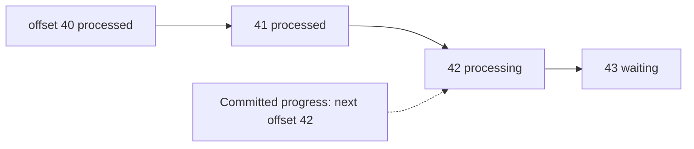

If the consumer crashes after side effects but before committing progress, Kafka may redeliver the record. This is why consumers need idempotency.

### 7.7 Replication and durability

In a production Kafka cluster, partitions are replicated across brokers. One replica is leader; followers copy it. Producers write to the leader.

Key settings:

- `replication.factor`: number of copies.
- `acks=0`: producer does not wait; fastest and weakest durability.
- `acks=1`: leader confirms; leader loss can still lose unreplicated data.
- `acks=all`: all required in-sync replicas confirm.
- `min.insync.replicas`: minimum replicas that must acknowledge when using `acks=all`.

A common production combination is replication factor 3, `acks=all`, and `min.insync.replicas=2`, adjusted to business requirements.

### 7.8 Retention versus message deletion

Kafka consumption does not normally delete a record. Retention is based on time or size, and consumers keep their own offsets. This enables replay.

Traditional work queues often remove or make a message unavailable after successful acknowledgment. That is one of the biggest conceptual differences between Kafka and RabbitMQ-style task queues.

### 7.9 Rebalancing

A rebalance occurs when consumers join, leave, fail, or topic partitions change. Kafka redistributes partitions among consumers. During or after a rebalance, records can be redelivered if progress was not committed.

Production improvements include:

- cooperative-sticky assignment to reduce partition movement;
- static membership where suitable;
- graceful shutdown;
- keeping poll-loop work within timing limits;
- monitoring rebalance frequency.

### 7.10 Why Kafka is fast

- Sequential append-only disk access.
- Operating-system page cache.
- Batching by producers and brokers.
- Compression of record batches.
- Efficient network transfer and zero-copy techniques where supported.
- Partition-level parallelism.

Kafka is not simply “in memory.” Its performance comes largely from efficient sequential I/O, batching, and the OS page cache while retaining durable storage.

---

## 8. How Kafka is used inside OpsMind

### 8.1 Where Kafka enters the picture

Kafka sits directly after authenticated ingestion and before expensive background processing:

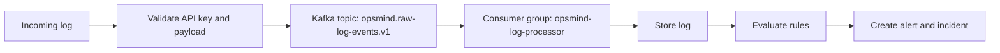

### 8.2 Concrete project behavior

- Topic: `opsmind.raw-log-events.v1`.
- Producer record key: service UUID.
- Producer value: serialized log event.
- Consumer group: `opsmind-log-processor`.
- Consumer responsibilities: idempotency, persistence, rule matching, deduplication, alerting, correlation, and analysis trigger.

### 8.3 Why not write directly to PostgreSQL from ingestion

A direct database write is not inherently wrong for small systems. Kafka becomes valuable because OpsMind expects bursty logs and wants asynchronous downstream processing and future independent consumers.

Strong interview answer:

> PostgreSQL is the durable business store, while Kafka is the transport and buffering layer. Kafka prevents rule processing from extending ingestion latency, allows the consumer to catch up after an outage, and permits replay or new consumer groups. The cost is eventual consistency and operational complexity, so I would not introduce it for a low-volume CRUD-only application.

### 8.4 Current implementation versus production version

| Area | Current project | Production hardening |
|---|---|---|
| Event format | JSON | Avro/Protobuf or versioned JSON schema |
| Topic management | Convenient local setup | Explicit provisioning and policies |
| Error handling | Application error handling | Retry topics and dead-letter topic |
| Publish consistency | Direct publish | Transactional outbox or Kafka transaction where appropriate |
| Brokers | Local Docker setup | Multi-broker replicated cluster |
| Monitoring | Health/manual CLI | Prometheus metrics, lag alerts, dashboards |
| Security | Local network | TLS, SASL, ACLs, secret rotation |

---

## 9. Kafka algorithms and delivery guarantees

### 9.1 At-most-once

Commit before processing. If processing fails afterward, the record can be lost from the application's perspective.

```text
commit -> process -> crash = record not retried
```

### 9.2 At-least-once

Process first, then commit. A crash after the side effect but before commit can cause redelivery.

```text
process -> crash -> redelivery -> process again
```

This is common and practical when the consumer is idempotent.

### 9.3 Exactly-once

Exactly-once is scoped, not magic. Kafka idempotent producers and transactions can make Kafka read-process-write pipelines exactly-once within supported boundaries. A transaction that also changes PostgreSQL is a distributed consistency problem.

For Kafka plus PostgreSQL, typical solutions are:

- idempotent consumer plus unique database constraints;
- transactional outbox for database-to-Kafka publication;
- inbox table for consumed event IDs;
- careful retry and reconciliation processes.

### 9.4 OpsMind idempotency algorithm

Each incoming event has an external `eventId`.

```text
if database contains eventId:
    treat as already processed
else:
    insert event
```

A unique database constraint should remain the final concurrency guard because two workers can both pass an application-level “not found” check at nearly the same time.

### 9.5 Producer idempotence

Kafka producer idempotence prevents duplicate records caused by producer retries inside a producer session by using producer IDs and sequence numbers. It does not automatically make PostgreSQL writes or arbitrary HTTP effects exactly-once.

### 9.6 Retry strategy

A professional retry design distinguishes errors:

| Error | Action |
|---|---|
| Temporary database timeout | Retry with exponential backoff and jitter |
| Redis temporary outage | Retry or use a defined degraded-mode policy |
| Invalid JSON/schema | Do not retry forever; send to dead-letter topic |
| Business validation failure | Record rejection reason and quarantine |
| Unknown exception | Limited retries, alert, then dead-letter |

Exponential backoff example:

```text
delay = min(maxDelay, baseDelay * 2^attempt) + randomJitter
```

### 9.7 Dead-letter topic

A dead-letter topic holds records that cannot be processed after limited retries. It prevents one poison record from blocking progress and gives operators a controlled place to inspect, fix, and replay failures.

Recommended topic set:

```text
opsmind.raw-log-events.v1
opsmind.raw-log-events.retry.v1
opsmind.raw-log-events.dlt.v1
```

### 9.8 Schema evolution

Events change over time. Safe evolution generally means:

- add optional fields with defaults;
- do not silently change field meaning;
- version breaking changes;
- validate at producer and consumer boundaries;
- use Avro/Protobuf plus a schema registry for larger organizations.

### 9.9 Consumer lag and backpressure

```text
lag = latest partition offset - consumer group's processed offset
```

Growing lag means production is faster than consumption. Possible responses:

- find and optimize the slow stage;
- increase partitions and consumers;
- batch database work;
- reduce per-event queries;
- pause or rate-limit producers if the business allows it;
- scale storage systems too, not only consumers.

### 9.10 Hot-partition mitigation

If one service produces most traffic, a `serviceId` key can overload one partition. Alternatives:

- composite key such as `serviceId + bucket`, sacrificing strict total per-service ordering;
- split high-volume tenants into dedicated topics;
- increase partitions with a planned migration;
- process order-independent event classes separately.

This is a trade-off between ordering and parallelism.

---

## 10. Kafka versus RabbitMQ and other alternatives

### 10.1 Kafka versus RabbitMQ mental model

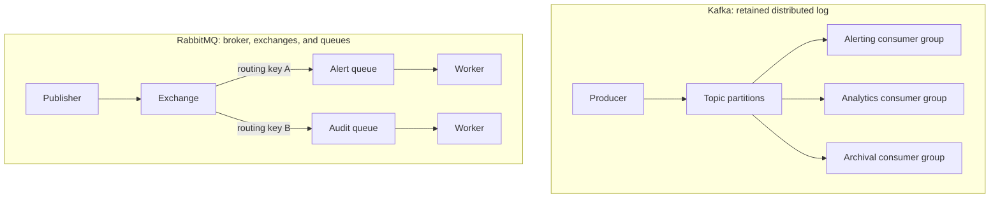

### 10.2 Comparison table

| Dimension | Kafka | RabbitMQ | AWS SQS/SNS | Redis Streams | Apache Pulsar |
|---|---|---|---|---|---|
| Primary model | Distributed retained log | Broker with exchanges and queues | Managed queue/pub-sub | Stream data structure | Distributed messaging and streaming |
| Best fit | Event streams, replay, analytics, high throughput | Task queues, flexible routing, request/work distribution | Cloud-native managed messaging | Smaller Redis-centric stream workloads | Multi-tenancy, geo-replication, queue + stream cases |
| Consumption | Consumers track offsets | Broker delivers and messages are acknowledged | Visibility timeout and acknowledgments | Consumer groups and IDs | Subscriptions and retained logs |
| Replay | First-class within retention | Not the default work-queue behavior | Limited compared with log systems | Possible while retained | First-class |
| Ordering | Per partition | Per queue, affected by multiple consumers/requeue | FIFO only with FIFO queues | Stream order | Per partition/key depending on mode |
| Routing | Topic and key/partition | Rich exchanges: direct, topic, fanout, headers | SNS topics to SQS queues | Application-designed | Topics and subscriptions |
| Operations | Heavier distributed platform | Mature broker operations | Provider-managed | Simple if Redis already exists | Distributed platform complexity |
| OpsMind fit | Excellent for replayable log pipeline | Good if it were mainly command/task dispatch | Good for AWS-managed deployment | Possible for modest throughput | Viable advanced alternative |

### 10.3 Why Kafka was selected for OpsMind

The dominant data is a continuous log-event stream. Important needs are buffering, replay, partitioned scale, and multiple possible downstream consumers. Kafka aligns naturally with those needs.

### 10.4 When RabbitMQ would be better

Choose RabbitMQ when:

- work is command-like: “send email,” “resize image,” or “run job”;
- flexible exchange routing is central;
- messages should normally leave the queue after acknowledgment;
- per-message priority or traditional work queues matter;
- throughput and replay requirements do not justify Kafka.

### 10.5 Can Kafka and RabbitMQ be used together?

Yes. For example:

- Kafka stores the operational event stream.
- An incident service publishes a command to RabbitMQ to send a PagerDuty-like notification or run a remediation job.

Do this only when the requirements justify two platforms.

### 10.6 Strong interview answer

> Kafka and RabbitMQ overlap, but their centers of gravity differ. Kafka is a partitioned retained log optimized for high-throughput streams, replay, and multiple consumer groups. RabbitMQ is a message broker with rich exchanges and queue semantics, well suited to task distribution and complex routing. OpsMind's central workload is a replayable log stream, so Kafka is the better primary backbone. If the system mainly dispatched one-time remediation commands, RabbitMQ could be simpler.

### 10.7 Common alternate questions

- “Why did you not use RabbitMQ?”
- “Is Kafka a message queue?”
- “Could Redis Streams replace Kafka?”
- “Would SQS be easier?”
- “What would make you change your decision?”
- “Can Kafka guarantee one-time processing?”

The interviewer is testing whether you understand requirements and trade-offs, not whether Kafka is always “better.”

---

## 11. Redis and the alert-deduplication algorithm

### 11.1 Why Redis is present

When a database fails, an application may emit the same error hundreds of times. Creating an alert for every log produces alert fatigue. OpsMind stores a temporary fingerprint key in Redis so repeated matches inside a window are suppressed.

### 11.2 Deduplication flow

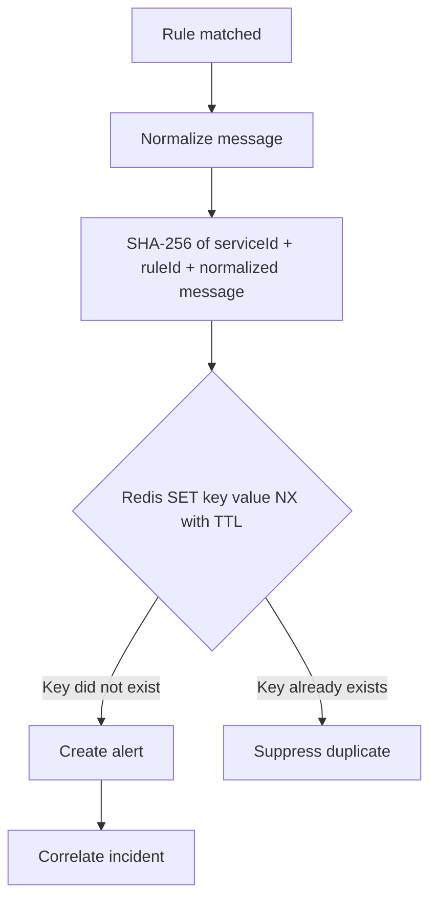

### 11.3 Current fingerprint algorithm

Conceptually:

```text
normalized = lowercase(message)
normalized = replace UUID values with placeholders
normalized = replace changing digits with placeholders
fingerprintInput = serviceId + ":" + ruleId + ":" + normalized
fingerprint = SHA-256(fingerprintInput)
```

Why normalize? These messages likely describe the same fault:

```text
Payment request 91382 timed out after 3000 ms
Payment request 82711 timed out after 5000 ms
```

### 11.4 Atomic Redis operation

The important operation is equivalent to:

```text
SET alert:dedup:<fingerprint> 1 NX EX <ttlSeconds>
```

- `NX`: write only if the key does not exist.
- `EX`/TTL: automatically expire the temporary marker.
- One atomic command prevents two simultaneous workers from both deciding they are first.

A non-atomic `GET` followed by `SET` has a race condition:

```text
Worker A GET -> missing
Worker B GET -> missing
Worker A SET -> create alert
Worker B SET -> create duplicate alert
```

### 11.5 Redis architecture in simple terms

Redis stores data primarily in memory and executes core commands atomically. Its event-driven command processing makes small operations very fast. Modern Redis can use I/O threads in some configurations, but the interview-relevant guarantee is atomic command execution, not simply the phrase “Redis is single-threaded.”

### 11.6 Why not use only PostgreSQL for deduplication

PostgreSQL could implement deduplication with a table, unique constraint, and expiration cleanup. Redis is preferred for fast temporary state and automatic TTL. PostgreSQL remains useful as the final durable constraint where permanent uniqueness matters.

### 11.7 Redis failure behavior

You must define a policy:

- **Fail open:** create alerts when Redis is unavailable. Risk: duplicate alerts, but detection continues.
- **Fail closed:** suppress or stop alert creation. Risk: missed alerts.
- **Fallback:** use a PostgreSQL uniqueness/window mechanism. More complexity, better resilience.

For incident response, fail-open plus a warning metric may be safer than silently missing critical alerts, depending on business requirements.

### 11.8 Redis alternatives

| Alternative | Advantage | Limitation |
|---|---|---|
| PostgreSQL table | Fewer systems, transactional | More cleanup and higher coordination cost |
| Local in-memory map | Very easy | Breaks across replicas and is lost on restart |
| Caffeine cache | Excellent per-instance cache | Not distributed coordination |
| Hazelcast | Distributed data grid | Different operational complexity |
| Kafka Streams state store | Stream-native state | Larger redesign and operational model |

---

## 12. Alert detection and incident correlation

### 12.1 Keyword rule

A keyword rule checks whether the log message contains a configured term, normally after case normalization.

```text
rule keyword = "connection timed out"
log message  = "Database connection timed out"
result       = match
```

If there are `R` enabled rules for the service and each string comparison scans a message of length `M`, a simple worst-case explanation is roughly `O(R × M)` per log. For a portfolio-scale project this is acceptable; at high scale, precompiled patterns or multi-pattern algorithms can help.

### 12.2 Count-threshold rule

A count rule means: alert when at least `N` matching events occur inside a window `W`.

Example:

```text
condition: ERROR count >= 5 during 5 minutes
```

Window choices:

- **Tumbling:** non-overlapping fixed windows.
- **Sliding:** continuously looks back by `W`; more accurate, more computation.
- **Session:** groups events separated by inactivity gaps.

OpsMind uses a practical database-backed count approach. At greater scale, windowed stream processing with Kafka Streams, Flink, or Redis sorted sets could reduce repeated database scans.

### 12.3 Multiple-pattern improvement

If thousands of keyword rules must be checked per event, Aho-Corasick can search many fixed keywords in approximately:

```text
O(message length + number of matches)
```

This is a possible scale improvement, not something to claim as already implemented.

### 12.4 Incident correlation

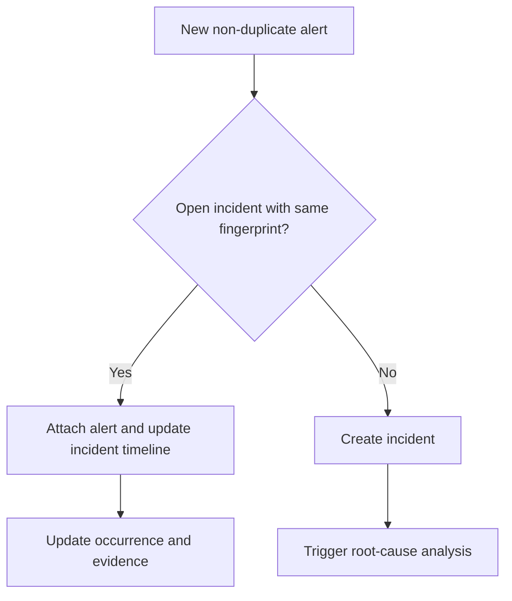

The fingerprint joins alerts that share service, rule, and normalized failure shape. A more advanced system could also consider:

- trace/span relationships;
- deployment version;
- service-dependency graph;
- temporal proximity;
- topology and region;
- learned similarity embeddings.

### 12.5 False-positive and false-negative controls

- Tune thresholds using real traffic.
- Add environment and severity conditions.
- Add suppression schedules and maintenance windows.
- Track rule precision and operator feedback.
- Version rules and audit changes.
- Test rules against historical events before enabling them.

---

## 13. PostgreSQL, JPA, transactions, and locking

### 13.1 Why PostgreSQL

OpsMind has relational entities and workflows: users own roles, services have rules and API keys, alerts attach to incidents, and incidents have timelines. PostgreSQL provides ACID transactions, constraints, indexes, joins, and durable storage.

### 13.2 ACID in OpsMind terms

- **Atomicity:** incident and related changes either commit together or roll back.
- **Consistency:** constraints prevent invalid references or duplicate unique values.
- **Isolation:** concurrent operations do not freely see partial changes.
- **Durability:** committed incident data survives process restarts.

### 13.3 JPA/Hibernate responsibilities

- Maps Java entities to tables.
- Tracks changes inside a persistence context.
- Generates SQL for repositories and queries.
- Supports relationships, transactions, validation, and optimistic locking.

JPA is a specification; Hibernate is the usual implementation used by Spring Data JPA.

### 13.4 Optimistic locking

The incident entity uses `@Version`. Updates behave conceptually like:

```sql
UPDATE incident
SET status = ?, version = version + 1
WHERE id = ? AND version = ?;
```

If another transaction already changed the row, zero rows are updated and an optimistic-lock exception is raised. This prevents silent lost updates without holding long database locks.

Use optimistic locking when conflicts are uncommon. Use pessimistic locking when contention is expected and serialized access is required, while accepting blocking and deadlock risk.

### 13.5 Transaction boundaries

Put `@Transactional` around a complete business operation, not every helper method. Avoid long transactions that include network calls to AI providers or other remote systems.

Kafka plus database cannot be made fully atomic by a normal local database transaction. That is why idempotency, outbox/inbox patterns, and reconciliation matter.

### 13.6 Index strategy

Useful indexes depend on actual queries. Likely candidates include:

- external event ID for idempotency;
- service ID plus occurrence time for log browsing;
- incident status and updated time;
- alert fingerprint and creation time;
- user email;
- API-key hash or lookup identifier.

Every index speeds reads but consumes storage and slows writes. Confirm choices using `EXPLAIN ANALYZE`.

### 13.7 N+1 query problem

N+1 happens when one query loads a list and then one extra query is executed for each item. Solutions include fetch joins, entity graphs, DTO projections, and deliberate batch fetching. Do not set every relationship to eager loading; that creates other performance problems.

### 13.8 Flyway migrations

Flyway stores ordered schema changes in versioned migration files. Benefits:

- repeatable environment creation;
- reviewed schema history;
- controlled deployment order;
- fewer manual database differences.

Do not edit a migration already applied to shared environments. Add a new migration.

### 13.9 Log-storage growth

PostgreSQL is appropriate for the current scale. For very high-volume full-text log search, move or replicate log documents to OpenSearch, ClickHouse, or object storage, while keeping transactional incident metadata in PostgreSQL. Time partitioning and retention policies can extend PostgreSQL's useful range.

---

## 14. Spring Boot backend concepts

### 14.1 Dependency injection and inversion of control

Classes declare dependencies; Spring creates and wires their instances. This reduces manual construction and makes tests easier because dependencies can be replaced with fakes or mocks.

### 14.2 Layered responsibilities

- **Controller:** HTTP parsing, validation trigger, status codes, response DTOs.
- **Service:** use cases, transactions, policies, orchestration.
- **Repository:** database access.
- **Entity:** persisted state and core invariants.
- **DTO:** external API contract.
- **Infrastructure adapters:** Kafka, Redis, security, and AI integration.

### 14.3 Why DTOs instead of exposing entities

- Avoid accidental serialization of sensitive or lazy-loaded fields.
- Decouple API contracts from database design.
- Apply request-specific validation.
- Prevent clients from setting server-managed fields.

### 14.4 Validation and exception handling

Bean Validation handles declarative checks such as non-empty messages and valid sizes. A global exception handler should convert errors into consistent HTTP responses with status, code, message, timestamp, and optional field violations.

### 14.5 `@Transactional` proxy behavior

Spring normally applies transactions through a proxy. Calling an annotated method from another method on the same object may bypass the proxy. Keep transaction boundaries on externally invoked service methods or move work into a separate bean.

### 14.6 `@Async` behavior

`@Async` also relies on proxy interception. It is suitable for non-blocking analysis work, but production systems need:

- a bounded, named executor;
- queue and rejection policy;
- propagated correlation/security context where needed;
- retries and error metrics;
- durable jobs if work must survive restarts.

### 14.7 Profiles and configuration

Spring profiles separate local/test/production behavior. OpsMind's container deployment activates the production profile. Secrets should come from environment variables or a secret manager, not committed files.

### 14.8 Actuator and OpenAPI

- Actuator exposes health and operational metrics endpoints.
- OpenAPI documents and allows exploration of the REST contract.

Restrict sensitive actuator endpoints in production.

---

## 15. JWT, API keys, authentication, and security

### 15.1 Why two authentication mechanisms

| Actor | Credential | Reason |
|---|---|---|
| Human operator | Email/password then JWT | Session-like access with roles and expiry |
| Monitored service | API key | Simple machine credential scoped to ingestion |

### 15.2 JWT structure

A JWT contains:

```text
base64url(header).base64url(payload).signature
```

- Header: algorithm and token type.
- Payload: subject, roles, token type, issued/expiry times.
- Signature: detects tampering.

JWT payloads are encoded, not encrypted. Never put secrets inside them.

### 15.3 Access and refresh tokens

In the project configuration:

- access token lifetime: 900 seconds;
- refresh token lifetime: 604800 seconds.

Short access tokens limit exposure. Refresh tokens obtain new access tokens without asking for a password each time.

Production improvements:

- refresh-token rotation;
- server-side revocation or token-family tracking;
- reuse detection;
- secure `HttpOnly`, `Secure`, `SameSite` cookies for browser refresh tokens;
- key rotation and asymmetric signing for larger deployments.

### 15.4 BCrypt

BCrypt is a slow, salted password hash designed to make brute-force attacks expensive. Passwords are never decrypted; login hashes the candidate according to the stored hash parameters and compares the result.

### 15.5 API-key storage

Show the raw API key only once. Store a hash, not the original secret. On ingestion, hash or securely verify the presented key, load its service scope, and reject revoked/expired keys.

### 15.6 RBAC

Role-based access control maps roles such as admin, responder, and viewer to permitted actions. Enforce authorization in the backend even if the frontend hides buttons.

### 15.7 Main security threats and controls

| Threat | Control |
|---|---|
| Credential stuffing | Rate limiting, MFA, monitoring |
| Stolen JWT | Short expiry, secure storage, revocation strategy |
| API-key leakage | Hashing, rotation, scoping, audit logs |
| XSS | Output escaping, CSP, avoid unsafe HTML, HttpOnly cookie strategy |
| CSRF | SameSite/CSRF protection when using cookies |
| SQL injection | Parameterized JPA queries and input validation |
| Log injection | Structured logging and newline/control sanitization |
| Secret exposure in logs | Redaction before storage and AI processing |
| Excessive ingestion | Rate limits, quotas, batch limits |

---

## 16. React frontend concepts

### 16.1 Frontend responsibilities

- Authentication experience.
- Dashboard and operational summaries.
- Services and API-key workflows.
- Log search and filters.
- Rule creation and management.
- Alert and incident investigation.
- Clear loading, empty, success, and error states.

### 16.2 Important React concepts

- Components split UI into reusable pieces.
- Props pass data downward.
- State stores changing UI data.
- Effects synchronize with external systems such as APIs.
- Routing maps URLs to pages.
- Context or a state library can share authentication and server state.

### 16.3 Server state versus UI state

- **Server state:** logs, incidents, alerts; fetched, cached, refreshed, invalidated.
- **UI state:** open modal, selected tab, search input.

A library such as TanStack Query can improve caching, request deduplication, retries, background refresh, and mutation invalidation.

### 16.4 Real-time update options

| Option | Best fit |
|---|---|
| Polling | Simple periodic refresh |
| Server-Sent Events | One-way live updates from server to browser |
| WebSocket | Two-way interactive real-time communication |

For live logs and incident updates, SSE is often simpler than WebSocket because most traffic flows server to browser.

### 16.5 User-friendly dashboard principles

- Show a clear “what should I do next?” action.
- Use severity colors consistently and accessibly.
- Let users move from a chart to filtered evidence.
- Preserve filters in URLs where practical.
- Provide empty-state setup instructions.
- Avoid charts without operational meaning.
- Display data freshness and failed-refresh status.

---

## 17. AI-assisted root-cause analysis

### 17.1 Current capability

The project can produce evidence-based probable causes and actions asynchronously. It should be described honestly as AI-assisted or analyzer-driven, not as guaranteed autonomous diagnosis.

### 17.2 Recommended analysis pipeline

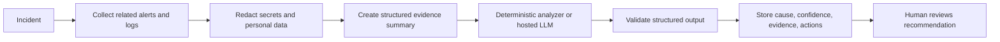

### 17.3 Safe AI output contract

Return structured fields such as:

```json
{
  "probableCause": "Database connection pool exhaustion",
  "confidence": 0.78,
  "evidence": ["Repeated timeout logs", "Pool acquisition errors"],
  "recommendedActions": ["Inspect active connections", "Review pool limits"],
  "limitations": ["No database server metrics were available"]
}
```

### 17.4 Hallucination controls

- Ground output only in attached evidence.
- Require citations to event IDs or metric names.
- Allow “insufficient evidence.”
- Validate output schema.
- Keep humans in control of remediation.
- Redact secrets before prompts.
- Treat log content as untrusted input to reduce prompt-injection risk.
- Record model, prompt version, latency, cost, and feedback.

### 17.5 RAG for incident response

Retrieval-augmented generation can retrieve relevant runbooks, past incidents, service ownership, and deployment changes before generation. It improves grounding but does not remove the need for access control, source citations, and evaluation.

### 17.6 Evaluation metrics

- top-cause accuracy;
- evidence citation correctness;
- unsafe-action rate;
- mean time to useful suggestion;
- operator acceptance rate;
- reduction in mean time to resolution;
- cost and latency per analysis.

---

## 18. Docker, configuration, observability, and deployment

### 18.1 Why Docker Compose

Docker Compose starts repeatable local versions of PostgreSQL, Kafka, Redis, the backend, and the frontend. It reduces “works on my machine” differences and makes the architecture demonstrable.

### 18.2 Container networking

Inside Compose, services call each other by service name, not `localhost`. `localhost` inside the backend container points to that backend container itself.

### 18.3 Configuration hierarchy

Keep environment-specific values outside code:

- database URL and credentials;
- Kafka bootstrap servers;
- Redis address;
- JWT signing key;
- allowed origins;
- AI provider key;
- retention and rate limits.

Use a secret manager for production secrets.

### 18.4 Observability pillars

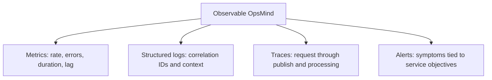

Important metrics:

- ingestion request rate, error rate, and p95/p99 latency;
- Kafka publish failures and consumer lag;
- consumer processing time and retry/DLT counts;
- Redis operation latency and failures;
- alert matches and deduplication ratio;
- incident creation and MTTA/MTTR;
- database pool utilization and slow queries;
- AI latency, failures, and cost.

### 18.5 Health checks

- **Liveness:** is the process alive?
- **Readiness:** can it safely receive traffic?
- **Dependency health:** can it reach database, Kafka, and Redis?

Do not restart a process endlessly merely because an optional downstream dependency is briefly unavailable; design health semantics deliberately.

---

## 19. Testing strategy

### 19.1 Testing pyramid

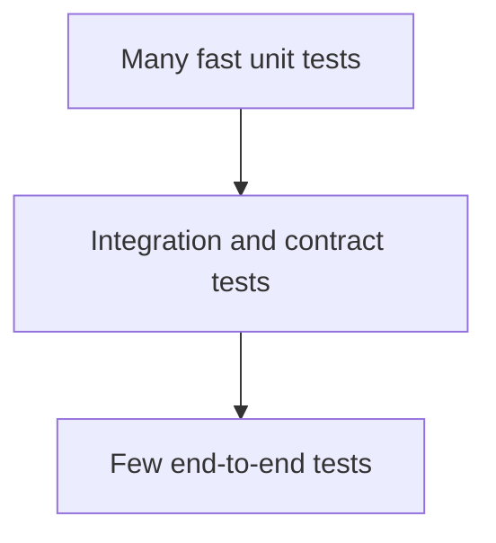

### 19.2 Unit tests

Test pure business behavior:

- message normalization;
- SHA-256 fingerprint stability;
- keyword matching;
- threshold decisions;
- severity/status transition rules;
- JWT validation edge cases;
- AI response parsing.

### 19.3 Integration tests

Use real disposable dependencies, ideally Testcontainers:

- PostgreSQL repository behavior and unique constraints;
- Redis `SET NX + TTL` deduplication;
- Kafka producer/consumer and idempotent redelivery;
- Flyway migrations from an empty database;
- secured endpoint authorization.

### 19.4 End-to-end test

1. Register/login.
2. Create a monitored service and API key.
3. Create an alert rule.
4. Post a matching event.
5. Wait for asynchronous processing.
6. Verify the log, alert, and incident in APIs/UI.
7. Post a normalized duplicate.
8. Verify it does not create another alert during TTL.

### 19.5 Failure and performance tests

- Stop the consumer and confirm Kafka lag grows while ingestion continues.
- Restart it and confirm lag returns toward zero.
- Stop Redis and verify the chosen degraded-mode behavior.
- Send duplicate event IDs concurrently and confirm one durable event.
- Load test batches and measure p95/p99 latency and consumer throughput.
- Introduce poison messages and confirm retry/DLT behavior once implemented.

---

## 20. Scaling and production-hardening plan

### 20.1 Evolution path

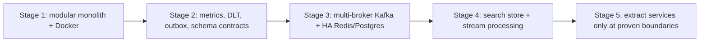

### 20.2 Scaling ingestion

- Keep APIs stateless.
- Run multiple backend replicas behind a load balancer.
- Apply per-key quotas and rate limits.
- Limit payload and batch size.
- Compress requests where appropriate.
- Scale Kafka partitions based on throughput and ordering requirements.

### 20.3 Scaling consumers

- Increase consumers up to useful partition count.
- Batch inserts and reduce per-event queries.
- Cache stable rule configuration carefully.
- Move threshold windows to stream processing if database queries dominate.
- Separate slow analysis into its own durable topic and consumer group.

### 20.4 Scaling storage

- Partition logs by time.
- Apply hot/warm/cold retention.
- Use OpenSearch for flexible text search or ClickHouse for analytical log queries.
- Keep incident workflow in PostgreSQL.
- Archive raw history to object storage.

### 20.5 Reliability improvements

- Kafka replication and appropriate acknowledgment settings.
- PostgreSQL backups, point-in-time recovery, replicas, and tested restores.
- Redis replication/sentinel or managed service, based on required durability.
- Retry and dead-letter topics.
- Transactional outbox/inbox.
- Chaos and disaster-recovery testing.
- Service-level objectives and error budgets.

### 20.6 Microservices decision

Do not split solely because microservices sound advanced. Extract a module when it needs independent scaling, release cadence, ownership, security boundary, or fault isolation. Candidate future services are ingestion, detection, incident workflow, notifications, and AI analysis.

---

## 21. Design decisions, limitations, and honest trade-offs

### 21.1 Strong decision record

| Decision | Why | Cost | Future trigger |
|---|---|---|---|
| Kafka after ingestion | Buffering, replay, independent processing | Eventual consistency and operations | Keep; harden cluster and schemas |
| Redis for dedup | Atomic TTL state | Extra dependency and failure policy | Replace only if stream state becomes better fit |
| PostgreSQL source of truth | Transactions and relations | Not ideal unlimited log search | Add specialized log store at scale |
| Modular monolith | Simple deployment and transactions | Modules share process | Extract when independent scaling/ownership is proven |
| JWT for users | Stateless API auth | Revocation/storage complexity | Add rotation, revocation, stronger key management |
| Deterministic/local RCA first | Demo works without provider key | Less semantic intelligence | Add grounded hosted model with evaluation |

### 21.2 Limitations you should state honestly

- Local Kafka is not the same as a fault-tolerant multi-broker cluster.
- JSON events lack the governance of a schema registry.
- Exactly-once behavior across Kafka and PostgreSQL is not automatically guaranteed.
- A dead-letter/retry-topic design should be added for poison events.
- Database log search will eventually need partitioning or specialized storage.
- Simple rule scanning will not scale to millions of complex rules unchanged.
- AI guidance is advisory and must be evidence-grounded.
- Browser token storage and refresh-token rotation should be hardened for production.

Interviewers value an engineer who knows a system's limitations more than one who calls every choice perfect.

### 21.3 What not to claim

Do not say:

- “Kafka guarantees global ordering.”
- “Kafka guarantees exactly once everywhere.”
- “Redis never loses data.”
- “JWT is encrypted.”
- “AI finds the correct root cause every time.”
- “Microservices automatically scale better.”
- “Docker Compose is a production orchestrator.”
- “The project is production-ready” without qualifying the remaining work.

---

## 22. Interview question bank with answers and alternate questions

### A. Project overview and architecture

#### Q1. Tell me about OpsMind.

**Strong answer:** Use the two-minute pitch from section 2, then offer to deep-dive into Kafka, alerting, security, or AI.

**Alternate forms:** “Walk me through your best project.” “What did you build?” “Explain the architecture.”

#### Q2. What was the hardest engineering problem?

**Strong answer:** Keeping asynchronous processing safe: Kafka can redeliver, concurrent logs can match the same rule, and multiple alerts can describe one incident. I combined external event IDs and database uniqueness for idempotency, atomic Redis TTL keys for alert deduplication, stable fingerprints for correlation, and optimistic locking for concurrent incident updates.

**Follow-up:** What race conditions remain? How did you test concurrency?

#### Q3. Why use a modular monolith?

**Strong answer:** It gives clear module boundaries without distributed transactions, network failures, multiple deployments, and operational overhead. I would extract modules only after independent scaling or ownership becomes a real requirement.

#### Q4. What is the source of truth?

**Strong answer:** PostgreSQL is the durable source of business truth. Kafka is the retained transport/event history for pipeline processing, and Redis stores temporary deduplication coordination state.

#### Q5. Is the system strongly consistent?

**Strong answer:** Database transactions are locally consistent, but the overall ingestion-to-dashboard flow is eventually consistent because Kafka processing is asynchronous.

#### Q6. Why is asynchronous processing useful here?

**Strong answer:** It protects ingestion latency from rule and AI processing, buffers bursts, enables retries and replay, and lets consumers scale independently.

#### Q7. What is the biggest bottleneck today?

**Strong answer:** At higher scale, per-event rule loading/count queries and PostgreSQL log storage would become pressure points. I would measure first, then cache/version rule sets, use stream windows, batch writes, and add specialized log storage.

#### Q8. How do components communicate?

**Strong answer:** Browser-to-backend and producer-to-ingestion use HTTP. Ingestion-to-processing uses Kafka. The application uses PostgreSQL for durable data and Redis for atomic TTL state.

#### Q9. How do you trace one event?

**Strong answer:** Preserve the external event ID, trace ID, service ID, Kafka topic/partition/offset, alert ID, and incident ID in structured logs and traces.

#### Q10. What would you redesign after learning more?

**Strong answer:** Add contract-managed events, DLT/retry topics, outbox/inbox, full observability, durable AI jobs, and better browser token handling before calling it production-ready.

### B. Kafka

#### Q11. What problem does Kafka solve in OpsMind?

It decouples ingestion from processing, buffers bursts, retains events for recovery/replay, preserves per-service ordering through keyed partitioning, and enables future independent consumers.

**Alternate:** “Where does Kafka come into the picture?” “Why not call the processor directly?”

#### Q12. What is a Kafka topic?

A named stream of records split into partitions and retained according to policy.

#### Q13. What is a partition?

An ordered append-only shard of a topic. It is the unit of ordering and consumer parallelism.

#### Q14. What is an offset?

A monotonically increasing position within one partition. Consumer groups commit offsets to track progress.

#### Q15. What key do you use and why?

The service UUID. It normally routes one service's events to the same partition, preserving per-service order while the partition count is stable.

#### Q16. How does partition selection work?

Conceptually, deterministic positive hash of the key modulo partition count. Exact client implementation can vary; the architectural property is stable key routing.

#### Q17. Does Kafka guarantee ordering?

Only within a partition. Global topic ordering requires one partition, which restricts parallelism.

#### Q18. What is a consumer group?

A set of consumers sharing topic partitions. Each partition is assigned to at most one active consumer in that group, while other groups read independently.

#### Q19. Can consumers exceed partitions?

Yes, but extra consumers in the same group are idle because a partition cannot be concurrently assigned to two consumers in that group.

#### Q20. What is consumer lag?

The distance between the latest offsets and a group's processed/committed offsets. Persistent growth indicates the consumer cannot keep up or is failing.

#### Q21. What causes rebalancing?

Consumer membership changes, failures, subscription changes, or partition changes. Rebalancing redistributes partitions and can temporarily pause work or cause redelivery.

#### Q22. At-most-once versus at-least-once?

At-most-once can lose work but avoids application retries. At-least-once retries but may duplicate side effects, so idempotency is required.

#### Q23. Does OpsMind have exactly-once processing?

It aims for effectively-once business outcomes using event IDs, unique constraints, and deduplication. Exactly-once across Kafka and PostgreSQL is not automatic; outbox/inbox or carefully scoped transactions are needed.

#### Q24. What is an idempotent consumer?

A consumer that produces the same durable outcome when it receives the same event multiple times.

#### Q25. What is an idempotent producer?

A Kafka producer feature that prevents duplicates caused by internal retries using producer identity and sequence numbers. It does not deduplicate arbitrary business events.

#### Q26. What happens if the consumer crashes after DB commit but before offset commit?

Kafka may redeliver. The external event ID and database uniqueness prevent a duplicate durable log.

#### Q27. What if Kafka is down?

The ingestion API cannot safely publish. It should return a retryable failure or use a durable local/outbox strategy; it must not falsely claim successful acceptance.

#### Q28. What if the consumer is down?

Kafka retains records, lag grows, and the consumer catches up after recovery, subject to retention capacity.

#### Q29. How would you handle poison messages?

Validate contracts, retry transient errors with backoff, and send permanent failures to a dead-letter topic with metadata and a controlled replay process.

#### Q30. Why is Kafka high throughput?

Sequential append, batching, compression, OS page cache, efficient network transfer, and partition parallelism.

#### Q31. What are `acks`?

Producer durability confirmation levels. `acks=all` waits for required in-sync replicas and is stronger than leader-only acknowledgment.

#### Q32. What is ISR?

In-sync replicas: replicas sufficiently caught up to participate in durable acknowledgment and leader election according to cluster policy.

#### Q33. What is replication factor?

Number of partition copies across brokers. More replicas improve fault tolerance at storage/network cost.

#### Q34. What happens when a broker fails?

If an eligible replica exists, leadership moves and clients refresh metadata. Availability and data safety depend on replication and acknowledgment configuration.

#### Q35. How long does Kafka keep records?

According to configured time/size retention or compaction policy, not merely until a consumer reads them.

#### Q36. What is log compaction?

Kafka retains the latest record per key over time, useful for changelog/state topics. It differs from time-based retention and is not required for every event topic.

#### Q37. What is a schema registry?

A service that stores versioned event schemas and enforces compatibility, commonly with Avro, Protobuf, or JSON Schema.

#### Q38. How would you choose partition count?

Based on target throughput, consumer parallelism, key distribution, broker capacity, growth, and ordering needs. More partitions are not free.

#### Q39. What is a hot partition?

One partition receiving disproportionate traffic due to skewed keys. Fixing it may require changing keys or topics and accepting weaker ordering.

#### Q40. What is backpressure?

Downstream capacity is below incoming rate. Kafka absorbs it temporarily as lag, but retention and storage are finite, so scale or rate-control is still necessary.

#### Q41. Can two consumer groups read the same event?

Yes. Each group tracks independent offsets, enabling alerting, analytics, and archival from one stream.

#### Q42. Kafka push or pull?

Consumers pull records. This lets them control batching and pace.

#### Q43. How do you replay events?

Reset a group's offsets or use a new group, after ensuring downstream processing is idempotent and replay side effects are safe.

#### Q44. What is the outbox pattern?

Write business data and an outbox record in one database transaction, then publish outbox records to Kafka. It prevents the database from committing while publication is silently lost.

#### Q45. What is the inbox pattern?

Store consumed event IDs with business changes so repeated deliveries can be recognized transactionally.

### C. Kafka, RabbitMQ, and messaging alternatives

#### Q46. Kafka versus RabbitMQ?

Kafka is centered on retained partitioned streams, replay, high throughput, and independent groups. RabbitMQ is centered on exchanges, queues, acknowledgments, flexible routing, and work distribution.

#### Q47. Why not RabbitMQ for OpsMind?

OpsMind benefits from replayable log history and multiple stream consumers. RabbitMQ would be reasonable for one-time jobs but less natural as the central retained log backbone.

#### Q48. Is Kafka a queue?

It can provide queue-like work sharing through a consumer group, but its retained-log model and independent offsets make it broader than a traditional queue.

#### Q49. RabbitMQ exchange types?

Direct routes exact keys, topic routes patterns, fanout broadcasts, and headers routes using headers.

#### Q50. What is acknowledgment in RabbitMQ?

The consumer tells the broker that processing succeeded. Unacknowledged messages can be redelivered if the consumer fails.

#### Q51. Could SQS replace Kafka?

For AWS-managed queue workloads, yes, with lower operations. It offers different replay, ordering, throughput, fan-out, and portability characteristics. Use SNS plus SQS for multiple consumers.

#### Q52. Could Redis Streams replace Kafka?

For modest scale when Redis is already central, possibly. Kafka has a stronger ecosystem and architecture for long-lived, high-throughput distributed event streaming and replay.

#### Q53. Kafka versus Pulsar?

Both support durable streams. Pulsar separates compute and storage and has strong multi-tenancy/geo features; Kafka has a very large ecosystem and operational familiarity. Choose using workload and team expertise.

#### Q54. When would you use both Kafka and RabbitMQ?

Kafka for facts/events and RabbitMQ for one-time commands or jobs requiring rich routing. Avoid running both without a real requirement.

#### Q55. What is event versus command?

An event states something happened: `LogReceived`. A command requests an action: `SendIncidentNotification`. Events can have many observers; commands usually have an intended handler.

### D. Redis

#### Q56. Why Redis?

Atomic, low-latency temporary deduplication keys with TTL across all application replicas.

#### Q57. Why not a Java map?

A local map is per process, disappears on restart, and cannot coordinate multiple replicas.

#### Q58. Explain `SET NX EX`.

Set the key only if absent and expire it automatically. It combines check, write, and expiration atomically.

#### Q59. Why is atomicity important?

It prevents concurrent consumers from both passing a separate read-before-write check and creating duplicate alerts.

#### Q60. What is TTL?

Time to live. Redis automatically removes the dedup marker after the configured window, allowing a later recurrence to alert again.

#### Q61. Is Redis durable?

It can persist via RDB snapshots and AOF, but durability depends on configuration. OpsMind uses it for reconstructible temporary state, not the sole permanent record.

#### Q62. What if Redis restarts?

Some dedup keys may disappear depending on persistence, causing temporary duplicate alerts. Durable incidents remain in PostgreSQL.

#### Q63. Redis versus Memcached?

Redis offers richer data structures, persistence options, scripting, streams, and atomic primitives. Memcached is a simpler distributed cache.

#### Q64. What is cache-aside?

Application checks cache, loads from database on miss, then fills cache. OpsMind's dedup key is coordination state rather than a classic cache-aside copy.

#### Q65. What is a cache stampede?

Many requests miss or expire the same key and hit the backend simultaneously. Mitigate with locks, jittered TTLs, request coalescing, or stale-while-revalidate.

#### Q66. Redis eviction policy?

It controls which keys are removed under memory pressure, such as LRU/LFU variants or no eviction. Dedup reliability depends on sizing and policy.

#### Q67. Could a Bloom filter help?

It can cheaply test probable membership with false positives, but ordinary Bloom filters do not naturally provide precise TTL per fingerprint and could incorrectly suppress alerts.

#### Q68. Why SHA-256 fingerprints?

They give stable fixed-size keys with negligible accidental collision risk. The larger practical risk is bad normalization grouping unrelated messages.

#### Q69. What is Redis Cluster?

It shards keys across nodes using hash slots and supports scale/failover. Multi-key operations require attention to hash-slot placement.

#### Q70. Fail open or fail closed on Redis outage?

State the business choice explicitly. For critical alerting, fail-open may preserve detection while accepting duplicates; add metrics and fallback if required.

### E. Database and JPA

#### Q71. Why PostgreSQL rather than MongoDB?

The central workflow is relational and transactional. PostgreSQL also supports JSON where flexibility is needed. MongoDB could fit document-heavy use cases but is not automatically better for logs.

#### Q72. What are ACID properties?

Atomicity, consistency, isolation, and durability; explain them with incident updates rather than only definitions.

#### Q73. What is optimistic locking?

A version check detects conflicting updates at commit time and prevents lost updates without long-held locks.

#### Q74. Optimistic versus pessimistic locking?

Optimistic is best for rare conflicts; pessimistic locks earlier and may block but can suit high-contention critical sections.

#### Q75. What is a transaction isolation level?

It defines which concurrent anomalies are allowed, such as dirty, non-repeatable, or phantom reads. Higher isolation improves guarantees but can reduce concurrency.

#### Q76. What is the N+1 problem?

One list query plus one query per item. Solve with planned fetch strategies or projections after measuring.

#### Q77. What is an index?

A data structure that speeds matching/sorting at the cost of storage and write overhead. Design from query patterns.

#### Q78. Why use a unique constraint for event ID?

It is the final race-safe idempotency guard even when two consumers concurrently perform a prior existence check.

#### Q79. Why Flyway?

Versioned, repeatable, reviewable schema evolution across environments.

#### Q80. What if a migration fails?

Stop deployment, inspect the failed transaction/state, fix with a new controlled migration or repair procedure, and never casually alter shared history.

#### Q81. JPA versus JDBC?

JPA reduces mapping and repository boilerplate for domain CRUD; JDBC offers explicit SQL and control for complex/high-performance operations. They can coexist.

#### Q82. When would you denormalize?

When measured read performance or analytical needs justify duplicating derived data, with an explicit consistency strategy.

#### Q83. How would you delete old logs?

Time-based partitioning, retention jobs, archival to object storage, legal/audit policies, and safe chunked deletion rather than huge transactions.

#### Q84. How do you diagnose a slow query?

Use query metrics and `EXPLAIN ANALYZE`, inspect scans/joins/cardinality/indexes, and fix based on evidence.

### F. Spring Boot, APIs, and security

#### Q85. Why Spring Boot?

Strong Java ecosystem, dependency injection, web/security/data/Kafka integrations, convention-based configuration, testing support, and production tooling.

#### Q86. What does dependency injection solve?

It separates object construction from business logic and supports replaceable/testable dependencies.

#### Q87. `@Component`, `@Service`, and `@Repository`?

All register beans; semantic stereotypes communicate responsibility, and repository also participates in persistence exception translation.

#### Q88. Why DTOs?

Stable, secure API contracts independent of persistence entities.

#### Q89. What does `@Transactional` do?

Through a Spring proxy, it opens/joins a transaction and commits or rolls back based on completion and exception rules.

#### Q90. What is the self-invocation problem?

Calling a proxied annotation method from the same object can bypass interception, affecting `@Transactional` and `@Async`.

#### Q91. How does JWT authentication work?

The filter extracts the bearer token, verifies signature/expiry/type, loads claims, and establishes the security context for authorization.

#### Q92. JWT versus session?

JWT supports stateless verification but makes revocation/rotation harder. Sessions centralize state and make immediate invalidation easier. Choice depends on architecture.

#### Q93. Is a JWT secure in localStorage?

It is accessible to JavaScript and therefore exposed during XSS. A hardened browser design often keeps refresh tokens in secure HttpOnly cookies and limits access-token exposure.

#### Q94. Authentication versus authorization?

Authentication proves identity; authorization decides allowed actions.

#### Q95. Why BCrypt?

Salted, adaptive, deliberately slow password hashing.

#### Q96. How should API keys be stored?

Show once, hash at rest, scope to a service/permission, support expiry/revocation/rotation, and audit use.

#### Q97. What HTTP status should ingestion return?

If accepted for asynchronous processing, `202 Accepted` is semantically strong. If processing is already fully complete, `200`/`201` may apply. Document the contract.

#### Q98. PUT versus PATCH?

PUT generally replaces a resource representation idempotently; PATCH applies partial changes. Define exact semantics.

#### Q99. How do you version APIs?

Use paths such as `/api/v1`, compatible evolution, deprecation policy, contract tests, and only break with a deliberate new version.

#### Q100. How do you prevent abuse of ingestion?

Scoped API keys, rate limits, quotas, batch/payload limits, validation, timeouts, audit logs, and network controls.

### G. React and UX

#### Q101. How does React state work?

State changes schedule rendering; derive values where possible and avoid duplicating server data across components.

#### Q102. What does `useEffect` do?

Synchronizes a component with external systems. Dependencies must be correct; avoid using effects for values that can be calculated during render.

#### Q103. How do you protect routes?

Frontend guards improve UX, but backend authorization provides real security. Redirect unauthenticated users and preserve intended destination.

#### Q104. Polling versus SSE versus WebSocket?

Polling is simplest, SSE suits one-way live updates, and WebSocket suits two-way real-time interaction.

#### Q105. How would you optimize a large log table?

Server-side pagination/filtering, virtualized rows, debounced search, stable columns, request cancellation, and specialized search storage at scale.

#### Q106. What makes a dashboard accessible?

Keyboard navigation, labels, sufficient contrast, focus states, semantic structure, screen-reader text, and not encoding severity only by color.

### H. AI, testing, DevOps, and behavior

#### Q107. Is the root-cause analysis really AI?

Answer honestly: the current analyzer is assistance based on available evidence; a hosted model can be integrated behind the same contract. Never claim certainty.

#### Q108. How do you prevent AI hallucinations?

Ground on evidence, require citations, validate schema, support insufficient-evidence output, use human approval, and evaluate systematically.

#### Q109. How do you protect secrets sent to an LLM?

Redact, minimize data, apply tenant access control, use approved provider retention settings, encrypt transport, and audit requests.

#### Q110. How would you evaluate the AI feature?

Use labeled historical incidents, expert scoring, citation correctness, unsafe-action rate, latency/cost, and A/B or shadow evaluation.

#### Q111. What should be unit tested?

Pure rules, normalization, fingerprints, transitions, security edge cases, and output parsers.

#### Q112. What should be integration tested?

Actual Kafka, Redis, PostgreSQL, migrations, security chain, and async event flow using disposable containers.

#### Q113. Why Testcontainers?

It tests against real dependency behavior while keeping tests repeatable and isolated.

#### Q114. How do you prove Kafka works?

Stop the consumer, ingest events, show topic offsets/lag growing, restart the consumer, and show records processed and lag reducing. This demonstrates real buffering, not only container health.

#### Q115. How do you prove Redis works?

Send two matching logs with different event IDs but the same normalized fingerprint. Show one alert, inspect the `alert:dedup:*` key and TTL, then demonstrate a new alert after expiry if the rule permits.

#### Q116. How do you test a deployment?

Health/readiness, migration status, authentication, one canary ingestion, Kafka lag, database/Redis connectivity, UI smoke test, metrics, and rollback readiness.

#### Q117. Tell me about a failure you handled.

Use STAR: situation, task, action, result. A valid project example is diagnosing duplicate alerts, replacing non-atomic check/set with Redis `SET NX + TTL`, then adding a concurrency test and metric.

#### Q118. How did you prioritize features?

Build the reliable event-to-incident path first, then operator usability, then advanced AI. Security and correctness are cross-cutting requirements, not final decorations.

#### Q119. How would you work with an SRE team?

Agree on SLOs, dashboards, runbooks, ownership, alert thresholds, load tests, failure drills, and post-incident learning.

#### Q120. What did this project teach you?

The hard part of event-driven systems is not publishing messages; it is defining ordering, retries, idempotency, failure behavior, observability, and honest consistency boundaries.

---

## 23. System-design scenarios

### Scenario 1: Traffic increases 100 times

Ask clarifying questions first: events/second, average event size, ordering, retention, tenants, query latency, and acceptable data loss.

Proposed approach:

1. Load test and locate the bottleneck.
2. Increase topic partitions based on throughput/key distribution.
3. Add consumers and batch database writes.
4. Cache/version rule sets or move window rules to stream processing.
5. Store searchable logs in ClickHouse/OpenSearch and archive raw data.
6. Keep incidents and security data in PostgreSQL.
7. Add quotas so one tenant cannot overload the system.
8. Track lag and scale before retention is threatened.

### Scenario 2: Duplicate incidents appear during a spike

Investigate:

- Are event IDs unique and database-constrained?
- Are fingerprints stable after normalization?
- Is Redis `SET NX` truly atomic?
- Did Redis evict/restart?
- Are multiple transactions racing to create incidents?
- Is optimistic locking/retry correct?

Improve with database constraints on active correlation identity where the model allows it, transactional incident creation, retry on conflict, and concurrency tests.

### Scenario 3: Kafka lag keeps growing

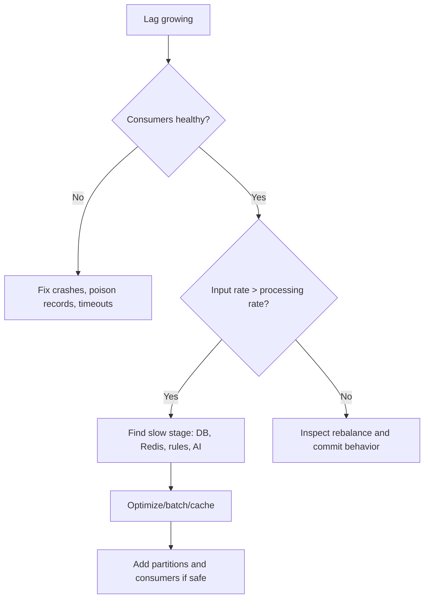

Do not blindly add consumers beyond partition count or beyond the capacity of PostgreSQL.

### Scenario 4: Redis is unavailable

Choose and document behavior:

- retry briefly for transient errors;
- fail-open for critical alert detection;
- record a degraded-mode metric and operator alert;
- optionally enforce a PostgreSQL fallback uniqueness window;
- reconcile duplicates later.

### Scenario 5: AI provider is slow or unavailable

Move analysis onto its own Kafka topic/consumer, use strict timeouts and circuit breaking, persist analysis status, retry safely, show “analysis pending/unavailable” in UI, and never block log ingestion or incident creation.

### Scenario 6: One tenant floods the platform

Use per-key rate limits and quotas, maximum batch/payload sizes, fair partition/key design, tenant metrics, circuit breaking, and optionally dedicated capacity for large tenants.

### Scenario 7: A breaking event-schema change is required

Introduce a new compatible version or topic, dual-publish temporarily, upgrade consumers, validate counts, migrate offsets carefully, and retire the old version after the compatibility window.

### Scenario 8: Data must be retained for one year

Define legal/search requirements, keep recent hot data in searchable storage, move older compressed events to object storage, use lifecycle policies, preserve integrity/audit metadata, and test restoration.

---

## 24. Live interview demonstration

### 24.1 Recommended eight-minute demo

1. Show an empty or clean dashboard.
2. Create a service and explain the one-time API key.
3. Create a keyword or threshold rule.
4. Send one matching log.
5. Show it in Logs, then show the alert and correlated incident.
6. Open the incident and explain evidence and recommended actions.
7. Send a normalized duplicate and show deduplication.
8. Show Kafka topic/consumer progress and the Redis TTL key.

### 24.2 Proof is stronger than “container is running”

| Component | Weak proof | Strong proof |
|---|---|---|
| Kafka | Container status is healthy | Events accumulate while consumer is stopped and process after restart |
| Redis | `PING` returns `PONG` | Atomic dedup key suppresses the second alert and has a TTL |
| PostgreSQL | Port is open | Durable rows survive application restart and constraints stop duplicates |
| JWT | Login returns a token | Tampered/expired tokens fail and role restrictions are enforced |
| AI | Text appears | Output cites evidence, validates schema, and handles missing evidence |

### 24.3 What to narrate during the demo

> This HTTP response means Kafka accepted the event; it does not yet mean the incident exists. The consumer processes it asynchronously. The service ID is the Kafka key, so related logs preserve partition order. When the rule matches, Redis atomically claims the fingerprint for a limited period. PostgreSQL stores the permanent log, alert, incident, and timeline. The analysis is asynchronous so a slow analyzer cannot block ingestion.

### 24.4 If a demo fails

Do not panic or hide it. Diagnose systematically:

```text
API accepted? -> Kafka topic offset moved? -> consumer lag/error?
-> PostgreSQL row? -> rule enabled? -> Redis dedup key?
-> alert/incident row? -> frontend request/filter?
```

This can demonstrate more engineering maturity than a perfectly memorized demo.

---

## 25. Rapid revision sheet

### 25.1 Ten facts to remember

1. Kafka is a retained, partitioned event log.
2. Ordering is guaranteed only inside a partition.
3. OpsMind keys Kafka records by service ID.
4. The consumer group shares partitions across workers.
5. At-least-once processing requires idempotent business logic.
6. Redis `SET NX + TTL` atomically suppresses duplicate alerts.
7. PostgreSQL is the durable source of business truth.
8. `@Version` prevents silent lost updates through optimistic locking.
9. JWT is signed and encoded, not encrypted.
10. AI output is advisory and must be grounded in evidence.

### 25.2 Five trade-offs to remember

| Choice | Benefit | Cost |
|---|---|---|
| Kafka | Decoupling, replay, throughput | Eventual consistency and operations |
| Redis | Fast distributed TTL state | Extra dependency and failure mode |
| PostgreSQL | Transactions and relations | Infinite log search needs specialized storage |
| Modular monolith | Simpler delivery | Less independent module scaling |
| JWT | Stateless verification | Revocation and browser storage complexity |

### 25.3 Five production improvements to remember

1. Retry and dead-letter topics.
2. Schema registry and compatible event contracts.
3. Outbox/inbox patterns.
4. Metrics, tracing, SLOs, and lag alerts.
5. HA infrastructure, secret rotation, and specialized log storage.

### 25.4 The best one-minute answer to “why Kafka and Redis?”

> Kafka and Redis solve different timing problems. Kafka sits after ingestion as a durable buffer and replayable stream. It lets the API accept logs without waiting for rule evaluation and lets consumers recover from downtime. Redis sits inside alert processing as short-lived distributed coordination state. An atomic `SET if absent` with TTL ensures only one worker creates an alert for the same fingerprint during the suppression window. Kafka protects and scales the event pipeline; Redis prevents alert storms; PostgreSQL stores the permanent result.

### 25.5 Whiteboard pseudocode

```text
ingest(batch, apiKey):
    service = authenticate(apiKey)
    validate(batch)
    for event in batch:
        kafka.publish(topic, key=service.id, value=event)
    return ACCEPTED

consume(event):
    if database.exists(event.eventId):
        return

    database.insert(event)

    for rule in enabledRules(event.serviceId):
        if rule.matches(event):
            fp = sha256(serviceId + ruleId + normalize(event.message))
            first = redis.setIfAbsent("alert:dedup:" + fp, ttl)

            if first:
                alert = database.insertAlert(event, rule, fp)
                incident = findOpenIncident(fp) or createIncident(fp)
                attach(alert, incident)
                requestAsyncAnalysis(incident)
```

---

## 26. Glossary

| Term | Plain-language meaning |
|---|---|
| Alert fatigue | Too many repetitive alerts causing people to ignore them |
| API key | Secret used by a machine to authenticate |
| Backpressure | Downstream processing cannot keep up with incoming data |
| Broker | Server that receives and distributes messages/events |
| Circuit breaker | Stops repeated calls to a failing dependency temporarily |
| Consumer lag | Unprocessed distance behind the latest Kafka record |
| Correlation | Grouping related alerts into the same incident |
| Dead-letter topic | Storage for events that repeatedly fail processing |
| Deduplication | Preventing repeated inputs from creating repeated outcomes |
| Event | Immutable fact that something happened |
| Eventual consistency | Different views become consistent after asynchronous processing |
| Fingerprint | Stable identifier representing a normalized failure pattern |
| Idempotency | Repeating an operation has no additional durable effect |
| Incident | Operational problem requiring investigation or response |
| ISR | Kafka replicas sufficiently synchronized with the leader |
| JWT | Signed token carrying identity and authorization claims |
| Offset | Position of a record inside one Kafka partition |
| Partition | Ordered shard of a Kafka topic |
| Rebalance | Redistribution of partitions among consumers |
| Retention | How long events remain stored |
| RTO | Maximum acceptable recovery time |
| RPO | Maximum acceptable data-loss window |
| SLO | Reliability target for a service |
| Source of truth | Authoritative durable system for a category of data |
| TTL | Time after which temporary data expires |
| Transactional outbox | Reliable DB-to-event publication pattern |

---

## Final interview advice

A senior-sounding explanation is not the one with the most buzzwords. It is the one that clearly answers:

- What requirement caused this component to exist?
- What guarantee does it provide?
- What guarantee does it **not** provide?
- What happens when it fails?
- How is success measured and tested?
- At what scale would the design change?

If you can walk through one log from producer to incident, explain the Kafka and Redis failure paths, and discuss alternatives without calling any technology universally best, you can defend OpsMind confidently in a strong backend or full-stack interview.
