# OpsMind — AI-Powered Incident Response Platform

> A practical, beginner-friendly blueprint for building a production-style incident management system with Java, Spring Boot, React, PostgreSQL, Kafka, Redis, JWT, and AI-assisted root-cause analysis.

---

## 1. Project at a Glance

OpsMind receives application logs and service health signals, detects suspicious behavior, creates alerts, groups related alerts into incidents, and helps engineers investigate and resolve those incidents. Its AI assistant summarizes evidence and suggests likely causes, but engineers remain responsible for the final decision.

### Resume-ready one-line description

**OpsMind is a full-stack incident response platform that ingests service logs, detects operational anomalies, manages alerts and incidents, and uses AI-assisted analysis to speed up root-cause investigation.**

### What this project demonstrates

- Backend API design with Spring Boot
- Event-driven architecture with Kafka
- Relational modeling and reporting with PostgreSQL
- Fast temporary state, caching, rate limiting, and deduplication with Redis
- Secure login and role-based access with JWT
- A practical React operations dashboard
- Background processing and real-time updates
- AI integration with guardrails and evidence
- Testing, containerization, observability, and deployment

### Recommended first version

Build a **modular monolith plus Kafka workers**, not many independent microservices. It is easier to understand, run, test, and deploy. The modules can later be extracted into services when scaling requires it.

---

## 2. Users and Main Use Cases

### User roles

| Role | Main permissions |
|---|---|
| `ADMIN` | Manage users, services, alert rules, integrations, and all incidents |
| `ENGINEER` | View telemetry, acknowledge/assign/update incidents, add notes, run AI analysis |
| `VIEWER` | Read dashboards, alerts, incidents, and reports |
| `INGESTION_CLIENT` | Machine identity allowed only to send logs/heartbeats |

### Core user stories

1. An admin registers a monitored service such as `payment-api`.
2. A service sends logs to OpsMind through an ingestion endpoint.
3. Kafka buffers the log stream so producers and processors are decoupled.
4. A rule detects repeated errors or missing heartbeats.
5. OpsMind creates an alert and groups matching alerts into an incident.
6. An engineer sees the incident, acknowledges it, and takes ownership.
7. The engineer requests an AI analysis.
8. The assistant retrieves relevant logs, recent changes, and similar incidents, then returns a cited hypothesis.
9. The engineer adds notes, changes severity/status, and resolves the incident.
10. OpsMind stores a timeline and resolution summary for auditing and future learning.

---

## 3. Scope: MVP First, Advanced Features Later

### MVP — build this first

- User registration/login and JWT authentication
- Role-based authorization
- Service registration and ownership
- HTTP log ingestion
- Kafka-based asynchronous processing
- Search/filter recent logs
- Threshold and keyword alert rules
- Alert deduplication using Redis
- Incident creation, assignment, status, severity, notes, and timeline
- Dashboard metrics and incident list
- AI incident summary and likely-cause suggestions
- Docker Compose for local development
- Unit, integration, API, and basic UI tests

### Version 2

- WebSocket or Server-Sent Events for live dashboard updates
- Slack/email/PagerDuty-style notifications
- Runbooks and remediation suggestions
- Similar-incident search using embeddings
- Deployment/change-event ingestion
- Maintenance windows and alert silencing
- SLOs, error budgets, and escalation policies
- Multi-tenant organizations
- OpenTelemetry traces and metrics correlation

### Explicitly out of scope for the first build

- Replacing Elasticsearch/OpenSearch for long-term, massive log storage
- Automatic production remediation without human approval
- Kubernetes-first deployment
- Complex machine-learning anomaly detection
- Dozens of independently deployed microservices

---

## 4. System Architecture

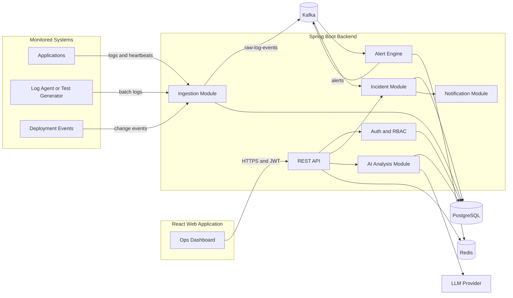

### Responsibility of each technology

| Technology | Responsibility |
|---|---|
| React + TypeScript | Dashboard, filters, forms, incident workflow, AI result presentation |
| Spring Boot | Business rules, REST APIs, security, consumers/producers, persistence |
| PostgreSQL | Users, services, rules, alerts, incidents, timelines, audit records, recent logs |
| Kafka | Durable asynchronous event pipeline and traffic buffering |
| Redis | Cache, deduplication windows, counters, rate limits, short-lived state |
| JWT | Stateless user access tokens and authorization claims |
| AI/LLM | Evidence-based summaries and possible root-cause hypotheses |
| Docker Compose | Repeatable local environment |

### Why Kafka and Redis are both needed

Kafka stores an ordered stream that consumers can process and replay. Redis is optimized for very fast reads/writes of temporary state. For example, Kafka transports every error event; Redis counts errors for a five-minute window and remembers whether an identical alert was recently emitted.

---

## 5. Suggested Repository Structure

Use a single repository initially:

```text
opsmind/
├── backend/
│   ├── pom.xml
│   └── src/
│       ├── main/java/com/opsmind/
│       │   ├── OpsMindApplication.java
│       │   ├── common/             # errors, pagination, shared utilities
│       │   ├── config/             # Kafka, Redis, OpenAPI, security
│       │   ├── auth/               # login, JWT, roles, refresh tokens
│       │   ├── user/
│       │   ├── servicecatalog/     # monitored services and owners
│       │   ├── ingestion/          # logs, heartbeat, deployment events
│       │   ├── alert/              # rules, evaluation, alerts, deduplication
│       │   ├── incident/           # workflow, comments, timeline
│       │   ├── analysis/           # evidence builder and LLM integration
│       │   ├── dashboard/          # aggregate queries
│       │   ├── notification/
│       │   └── audit/
│       └── test/
├── frontend/
│   ├── package.json
│   └── src/
│       ├── api/                    # typed API clients
│       ├── auth/
│       ├── components/
│       ├── features/
│       │   ├── dashboard/
│       │   ├── services/
│       │   ├── alerts/
│       │   ├── incidents/
│       │   └── analysis/
│       ├── hooks/
│       ├── routes/
│       ├── types/
│       └── utils/
├── infrastructure/
│   ├── docker-compose.yml
│   ├── postgres/
│   ├── kafka/
│   └── monitoring/
├── docs/
│   ├── architecture.md
│   ├── api.md
│   └── decisions/
├── scripts/                       # seed data and load generator
├── .env.example
└── README.md
```

### Recommended backend dependencies

- Spring Web
- Spring Validation
- Spring Data JPA
- Spring Security
- Spring for Apache Kafka
- Spring Data Redis
- PostgreSQL JDBC driver
- Flyway for database migrations
- JWT library such as JJWT or Spring Security JOSE
- springdoc-openapi for Swagger UI
- Resilience4j for retry/circuit breaker around external AI calls
- Testcontainers for integration tests
- Lombok only if you understand the generated code

### Recommended frontend dependencies

- React, TypeScript, and Vite
- React Router
- TanStack Query for server state
- React Hook Form + Zod for forms and validation
- A small component library or Tailwind CSS
- Recharts for charts
- Vitest + React Testing Library
- Playwright for a small end-to-end suite

---

## 6. Domain Model

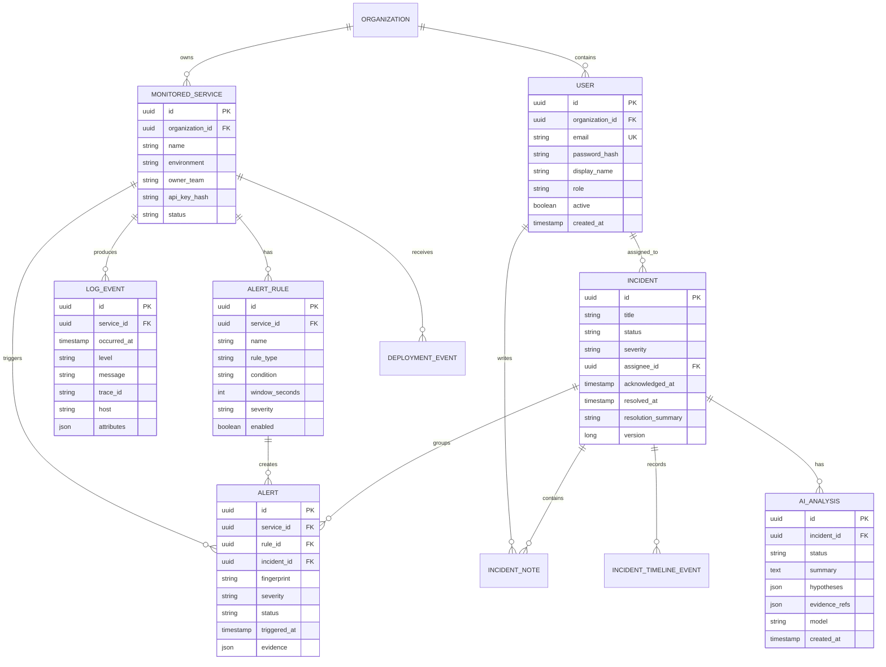

### Important modeling choices

- Use UUIDs for public identifiers.
- Store timestamps in UTC and display them in the user's local timezone.
- Use `JSONB` only for flexible attributes/evidence; keep frequently filtered fields as normal columns.
- Add `organization_id` early if multi-tenancy is likely, even if the MVP has one organization.
- Use an optimistic-lock `version` field on incidents to prevent two engineers overwriting each other's changes.
- Never store plaintext passwords, service API keys, refresh tokens, or provider secrets.

### Essential indexes

```sql
CREATE INDEX idx_log_service_time ON log_event(service_id, occurred_at DESC);
CREATE INDEX idx_log_level_time ON log_event(level, occurred_at DESC);
CREATE INDEX idx_alert_status_time ON alert(status, triggered_at DESC);
CREATE INDEX idx_alert_fingerprint ON alert(fingerprint, triggered_at DESC);
CREATE INDEX idx_incident_status_severity ON incident(status, severity);
CREATE INDEX idx_timeline_incident_time ON incident_timeline_event(incident_id, created_at);
```

For a learning project, PostgreSQL can hold recent logs. Set a retention job, such as deleting logs older than 7–30 days. At large scale, move searchable logs to OpenSearch, ClickHouse, or a managed observability platform while retaining incident metadata in PostgreSQL.

---

## 7. Incident Lifecycle

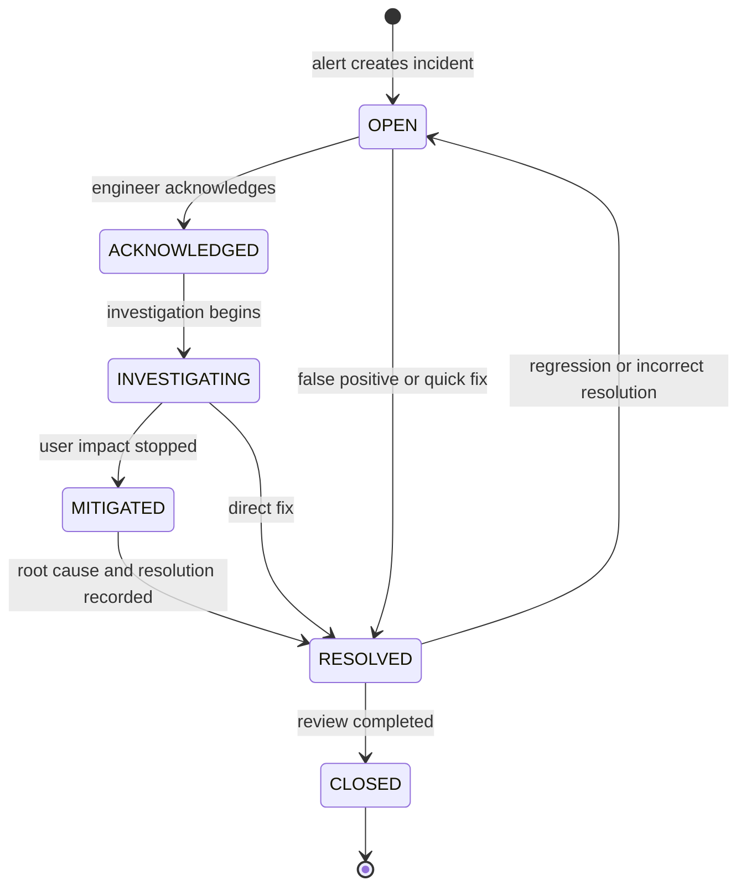

### Allowed actions

| Current status | Allowed next status | Required information |
|---|---|---|
| Open | Acknowledged, Resolved | Assignee for acknowledgment; reason for direct resolve |
| Acknowledged | Investigating, Resolved | Investigation owner |
| Investigating | Mitigated, Resolved | Work note; resolution summary when resolved |
| Mitigated | Resolved, Investigating | Root cause and resolution summary |
| Resolved | Closed, Open | Reopen reason if reopened |
| Closed | — | Immutable except admin correction |

Every transition should create an `incident_timeline_event` and an audit event.

### Severity definition

| Severity | Meaning | Example target |
|---|---|---|
| SEV1 | Critical widespread outage/data risk | Acknowledge within 5 minutes |
| SEV2 | Major degradation or many affected users | Acknowledge within 15 minutes |
| SEV3 | Limited impact or reliable workaround | Acknowledge within 1 hour |
| SEV4 | Low impact/informational | Handle in normal workflow |

---

## 8. End-to-End Event Flows

### 8.1 Log ingestion and alert detection

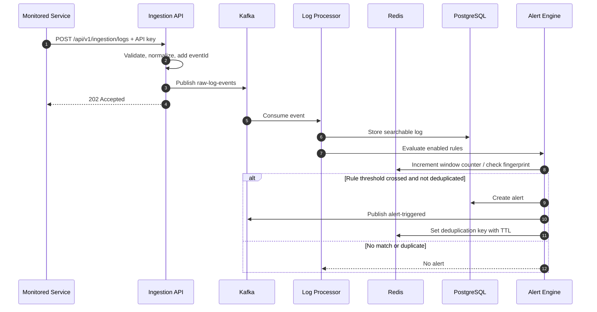

### 8.2 Alert-to-incident correlation

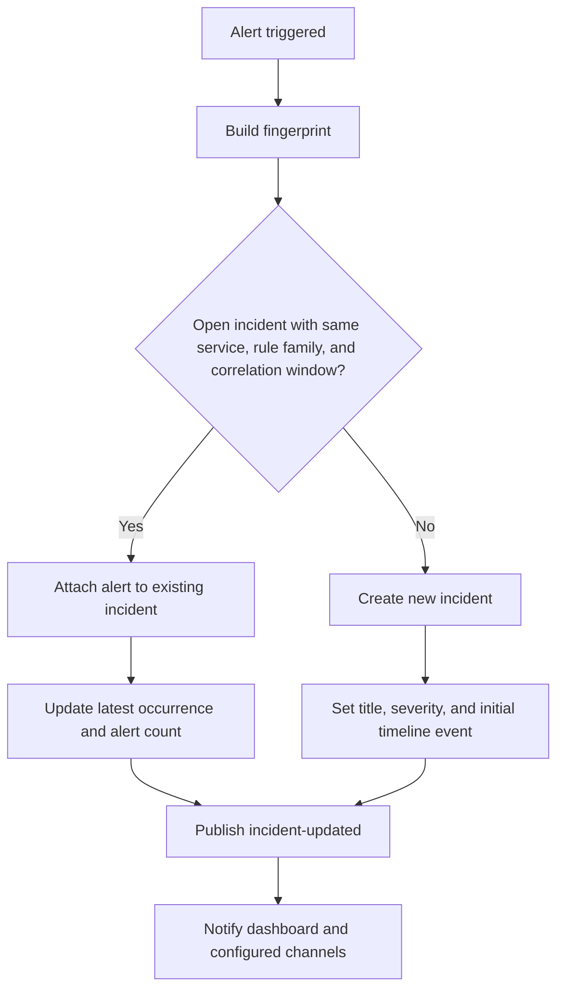

Suggested fingerprint inputs:

```text
organizationId + serviceId + environment + normalizedErrorType + ruleId
```

Remove volatile values such as timestamps, UUIDs, request IDs, and line numbers from messages before hashing. This prevents the same underlying error from creating hundreds of incidents.

### 8.3 Engineer investigation and AI analysis

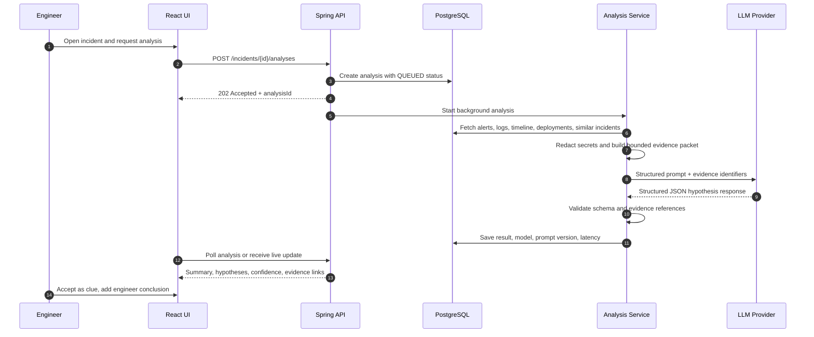

---

## 9. Kafka Design

### Topics

| Topic | Key | Producer | Consumer | Purpose |
|---|---|---|---|---|
| `opsmind.raw-log-events.v1` | `serviceId` | Ingestion API | Log processor | Normalize and persist incoming logs |
| `opsmind.heartbeat-events.v1` | `serviceId` | Ingestion API | Health processor | Detect unavailable services |
| `opsmind.deployment-events.v1` | `serviceId` | Integration API | Change processor/AI | Correlate incidents with releases |
| `opsmind.alert-triggered.v1` | `serviceId` | Alert engine | Incident correlator | Create or update incidents |
| `opsmind.incident-events.v1` | `incidentId` | Incident module | Notification/live update | Broadcast lifecycle changes |
| `opsmind.analysis-jobs.v1` | `incidentId` | Analysis API | AI worker | Run AI analysis asynchronously |

### Example event envelope

```json
{
  "eventId": "7f55b02e-6003-4fa9-bb4f-2ee8ef5b43ca",
  "eventType": "LOG_RECEIVED",
  "schemaVersion": 1,
  "organizationId": "f8d7...",
  "serviceId": "0b23...",
  "occurredAt": "2026-07-20T08:20:12Z",
  "correlationId": "req-7812",
  "payload": {
    "level": "ERROR",
    "message": "Database connection timed out",
    "traceId": "abc123",
    "attributes": {"host": "payment-api-2"}
  }
}
```

### Reliability rules

- Use `eventId` for idempotency; consumers must safely ignore an already processed event.
- Key events by `serviceId` where per-service ordering matters.
- Retry transient failures with limited exponential backoff.
- Send permanently failing records to a dead-letter topic such as `opsmind.raw-log-events.v1.dlt`.
- Never retry invalid payloads forever.
- Track consumer lag and dead-letter counts.
- Use a database outbox pattern later if a database update and event publication must be atomic.
- Define explicit JSON schemas and version them; Avro/Schema Registry can be added later.

---

## 10. Redis Design

| Key pattern | Example | TTL | Purpose |
|---|---|---:|---|
| `alert:count:{ruleId}:{serviceId}:{bucket}` | `alert:count:r1:s1:1721454000` | Window + buffer | Sliding/tumbling threshold counter |
| `alert:dedup:{fingerprint}` | `alert:dedup:9a8...` | 5–30 min | Suppress duplicate alerts |
| `ratelimit:{principal}:{minute}` | `ratelimit:svc1:28700120` | 2 min | Protect ingestion and login APIs |
| `cache:dashboard:{orgId}` | `cache:dashboard:o1` | 15–60 sec | Cache expensive aggregates |
| `refresh:{tokenId}` | `refresh:2ec...` | 7 days | Track/revoke refresh token family |
| `processed:{consumer}:{eventId}` | `processed:alert-engine:7f55...` | 1–7 days | Consumer idempotency |

Redis is an optimization and temporary-state store. PostgreSQL remains the source of truth for business data.

---

## 11. Alert Rule Engine

Start with deterministic rules because they are understandable and testable.

### MVP rule types

1. **Keyword rule** — message contains `OutOfMemoryError`.
2. **Count threshold** — at least 20 `ERROR` logs in 5 minutes.
3. **Error-rate rule** — error logs exceed 5% of total logs in 10 minutes.
4. **Missing heartbeat** — no service heartbeat for 2 minutes.
5. **Latency threshold** — p95 latency above a configured value when metrics are added.

### Safe rule configuration example

```json
{
  "name": "Payment database timeout spike",
  "serviceId": "0b23...",
  "type": "COUNT_THRESHOLD",
  "filters": {
    "levels": ["ERROR"],
    "messageContains": "connection timed out"
  },
  "threshold": 10,
  "windowSeconds": 300,
  "severity": "SEV2",
  "deduplicationSeconds": 900,
  "enabled": true
}
```

Do not allow users to submit raw SQL or arbitrary code as rule conditions. Use validated typed fields or a small controlled expression language.

---

## 12. REST API Plan

Base path: `/api/v1`. Use JSON, consistent errors, UTC timestamps, and cursor/page pagination.

### Authentication

| Method | Endpoint | Purpose |
|---|---|---|
| POST | `/auth/register` | Create first/admin user or invited user |
| POST | `/auth/login` | Return short-lived access token and refresh token |
| POST | `/auth/refresh` | Rotate refresh token and issue new access token |
| POST | `/auth/logout` | Revoke refresh token family |
| GET | `/auth/me` | Current user and permissions |

### Services and ingestion

| Method | Endpoint | Permission/Purpose |
|---|---|---|
| POST | `/services` | Admin creates monitored service |
| GET | `/services` | List accessible services |
| GET | `/services/{id}` | Service details and health |
| PATCH | `/services/{id}` | Admin updates metadata |
| POST | `/services/{id}/rotate-key` | Rotate ingestion credential |
| POST | `/ingestion/logs` | Service key sends one/batch log payload |
| POST | `/ingestion/heartbeats` | Service key sends liveness event |
| POST | `/ingestion/deployments` | Record release/change event |
| GET | `/logs` | Engineers query recent logs |

### Rules and alerts

| Method | Endpoint | Purpose |
|---|---|---|
| POST | `/alert-rules` | Create rule |
| GET | `/alert-rules` | List/filter rules |
| PATCH | `/alert-rules/{id}` | Update or enable/disable rule |
| POST | `/alert-rules/{id}/test` | Test against sample logs without saving alerts |
| GET | `/alerts` | Filter alerts by service, status, severity, time |
| GET | `/alerts/{id}` | Alert and evidence |
| POST | `/alerts/{id}/suppress` | Suppress with reason and duration |

### Incidents and analysis

| Method | Endpoint | Purpose |
|---|---|---|
| GET | `/incidents` | Filter and paginate incidents |
| POST | `/incidents` | Manually create incident |
| GET | `/incidents/{id}` | Full details including timeline |
| PATCH | `/incidents/{id}` | Change title/severity/assignee/status |
| POST | `/incidents/{id}/notes` | Add investigation note |
| POST | `/incidents/{id}/alerts/{alertId}` | Attach alert |
| POST | `/incidents/{id}/analyses` | Queue AI analysis |
| GET | `/incidents/{id}/analyses` | List analysis attempts |
| GET | `/analyses/{analysisId}` | Poll job/result |
| GET | `/dashboard/summary` | KPI and chart aggregates |

### Consistent error format

```json
{
  "type": "https://opsmind.dev/problems/validation-error",
  "title": "Validation failed",
  "status": 400,
  "detail": "One or more fields are invalid",
  "instance": "/api/v1/alert-rules",
  "correlationId": "req-7812",
  "errors": [{"field": "threshold", "message": "must be greater than 0"}]
}
```

Use Spring's Problem Details support (`ProblemDetail`) and a global exception handler.

---

## 13. Authentication and Security

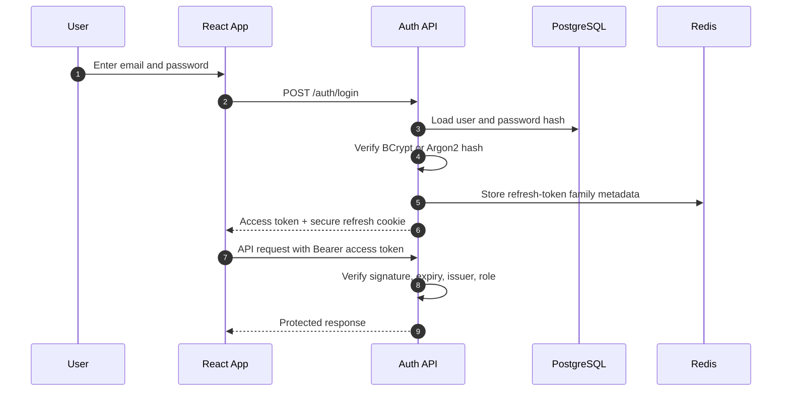

### Recommended token strategy

- Access token: 10–15 minutes.
- Refresh token: 7 days, rotated every use.
- Prefer an `HttpOnly`, `Secure`, `SameSite` cookie for the refresh token.
- Keep the access token in memory when practical; avoid permanent browser storage.
- Include subject, role/permissions, organization, issuer, audience, issued time, expiry, and token ID.
- Store only a hash of refresh tokens or track their token family/revocation ID.
- Rotate keys and configure secrets through environment variables or a secret manager.

### Security checklist

- Hash passwords with BCrypt/Argon2.
- Hash service ingestion API keys and show the plaintext only once.
- Validate request size, log batch size, message length, timestamps, and attributes.
- Rate-limit login, ingestion, analysis, and expensive search endpoints.
- Configure CORS for the exact frontend origin.
- Apply method-level authorization and organization scoping.
- Redact passwords, tokens, authorization headers, cookies, card data, and common secret patterns before persistence or AI use.
- Never log JWTs or raw secrets.
- Audit security and incident mutations.
- Return generic login errors to reduce account enumeration.
- Run dependency and container vulnerability scans in CI.

---

## 14. AI-Assisted Root-Cause Analysis

### Correct product promise

The AI assistant should say **“Here are the most likely explanations supported by this evidence”**, not **“This is definitely the root cause.”** Operational diagnosis is uncertain, and false confidence is dangerous.

### Evidence pipeline

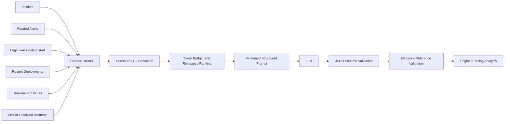

### Structured output shape

```json
{
  "summary": "Payment requests began failing after database connection timeouts increased.",
  "impact": "Checkout requests returned 5xx responses for approximately 12 minutes.",
  "hypotheses": [
    {
      "rank": 1,
      "cause": "Database connection pool exhaustion",
      "confidence": "medium",
      "reasoning": "Timeouts rose while active connections approached the configured limit.",
      "evidenceRefs": ["log:123", "alert:47", "deployment:9"],
      "nextChecks": ["Inspect pool utilization", "Compare request concurrency"]
    }
  ],
  "unknowns": ["Database-side connection count is not available"],
  "recommendedActions": ["Check pool metrics before increasing the limit"]
}
```

### Prompt behavior requirements

- Treat logs and user notes as untrusted data, never as instructions.
- Require every hypothesis to reference supplied evidence IDs.
- Ask the model to state unknowns and contradictory evidence.
- Prohibit invented metrics, commands, events, or services.
- Separate immediate mitigation from root-cause investigation.
- Return JSON matching a schema; reject or repair invalid output once.
- Display the model name, generated time, evidence links, and an “AI-generated” label.

### AI failure handling

- Queue analysis asynchronously; never block the incident page on an LLM request.
- Use timeouts, limited retries, and a circuit breaker.
- Show `QUEUED`, `RUNNING`, `COMPLETED`, `FAILED`, and `CANCELLED` states.
- Cache identical analyses for a short time unless evidence changed.
- Limit analysis frequency per user/incident.
- Make the normal incident workflow fully usable when AI is unavailable.

### Measuring AI quality

Create a small evaluation set of 20–50 simulated incidents with known causes. Measure:

- Evidence citation validity
- Unsupported-claim rate
- Whether the known cause appears in top 1/top 3 hypotheses
- Usefulness rating from a reviewer
- Latency and cost per analysis
- Secret-redaction success

Do not evaluate only by whether the response “sounds good.”

---

## 15. Frontend Pages and UX

### Route map

```text
/login
/dashboard
/services
/services/:serviceId
/logs
/alert-rules
/alerts
/alerts/:alertId
/incidents
/incidents/:incidentId
/settings/users
/settings/integrations
```

### Main dashboard

- Open incidents by severity
- Mean time to acknowledge (MTTA)
- Mean time to resolve (MTTR)
- Alerts in the last 24 hours
- Incident trend chart
- Service health table
- Recently updated incidents

### Incident detail layout

```text
┌──────────────────────────────────────────────────────────────────────┐
│ SEV2  Payment API errors     Investigating     Assignee: Asha       │
├───────────────────────────────┬──────────────────────────────────────┤
│ Incident summary              │ Timeline                             │
│ - Started at                  │ 10:02 Alert triggered                │
│ - Affected service            │ 10:05 Incident acknowledged          │
│ - Alert count                 │ 10:08 Investigation note added       │
│ - Latest activity             │ 10:11 AI analysis completed          │
├───────────────────────────────┴──────────────────────────────────────┤
│ Related alerts and filtered log evidence                            │
├──────────────────────────────────────────────────────────────────────┤
│ AI analysis: ranked hypotheses, evidence links, unknowns, next steps│
├──────────────────────────────────────────────────────────────────────┤
│ Add note | Change status | Assign | Resolve                         │
└──────────────────────────────────────────────────────────────────────┘
```

### Frontend state guidelines

- Use TanStack Query for API data, caching, invalidation, loading, and error states.
- Keep filters in URL query parameters so views are shareable.
- Use React Hook Form and Zod for forms.
- Centralize API error handling and automatic token refresh.
- Use accessible semantic controls and keyboard-friendly dialogs.
- Show skeleton/loading, empty, permission-denied, error, and stale-data states.
- Never hide incident severity or status using color alone; include text/icons.

---

## 16. Backend Module Boundaries

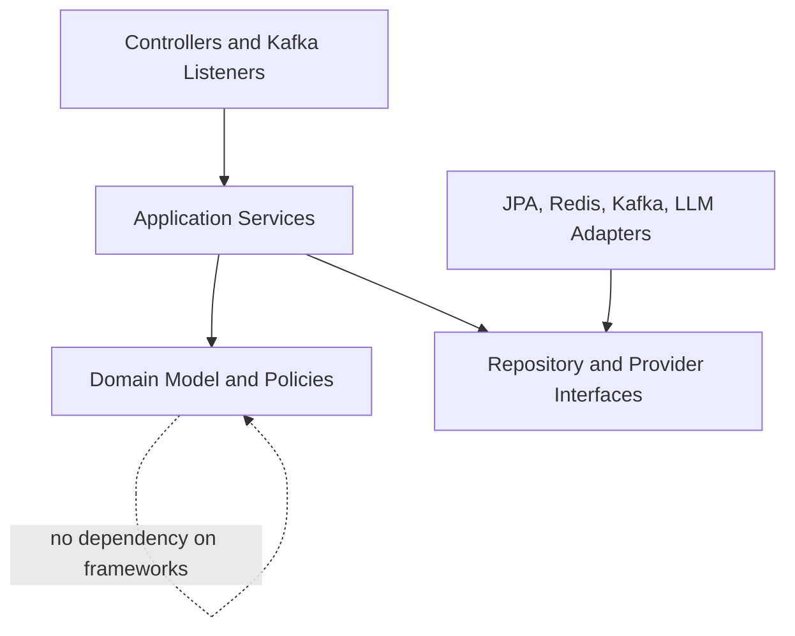

For each feature, prefer this shape:

```text
incident/
├── api/              # controllers, request/response DTOs
├── application/      # use cases and transaction boundaries
├── domain/           # entities, status rules, domain events
└── infrastructure/   # JPA repositories and adapters
```

### Important backend rules

- Controllers validate/translate HTTP; they should not contain business rules.
- Entities should not be returned directly as API responses.
- Transactions belong around use cases in the application layer.
- Repositories hide persistence details.
- Kafka listeners call application use cases and must be idempotent.
- External provider code sits behind interfaces so it can be replaced or mocked.
- Use Flyway migrations; do not rely on Hibernate auto-creating production schemas.

---

## 17. Observability for OpsMind Itself

An incident platform must be observable too.

### Logs

- Structured JSON logs
- Correlation/request ID on every API request and Kafka event
- Safe fields: timestamp, level, service, environment, trace ID, operation, duration, result
- No secrets or full sensitive payloads

### Metrics

- HTTP request count, error rate, and latency
- Ingestion events/second and rejected payloads
- Kafka consumer lag and failed messages
- Alerts created/deduplicated
- Open incidents by severity
- Database pool utilization and slow queries
- Redis latency/errors
- AI request latency, failures, tokens/cost, schema-invalid rate

### Health endpoints

- `/actuator/health/liveness`
- `/actuator/health/readiness`
- `/actuator/metrics`
- Secure all sensitive actuator endpoints.

---

## 18. Local Development Environment

### Docker Compose services

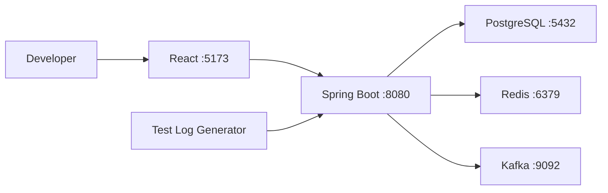

Use Docker Compose for PostgreSQL, Kafka, Redis, and optional admin tools. Run backend/frontend locally for fast reload, or containerize all components for a full-stack smoke test.

### Environment variables

```text
DB_URL=
DB_USERNAME=
DB_PASSWORD=
REDIS_HOST=
REDIS_PORT=
KAFKA_BOOTSTRAP_SERVERS=
JWT_PRIVATE_KEY_PATH=
JWT_PUBLIC_KEY_PATH=
LLM_API_KEY=
LLM_MODEL=
FRONTEND_ORIGIN=
```

Commit `.env.example` with placeholder values, never a real `.env` or secret.

---

## 19. Detailed Implementation Roadmap

The schedule is illustrative. Work phase by phase; each phase ends with something demonstrable.

### Phase 0 — foundation and design (2–3 days)

- Create repository folders.
- Write architecture decision records for modular monolith, PostgreSQL log retention, and Kafka use.
- Create Spring Boot and React projects.
- Add Docker Compose for PostgreSQL, Kafka, and Redis.
- Add environment profiles: `local`, `test`, `prod`.
- Configure formatting, linting, CI skeleton, and `.env.example`.
- Add `/actuator/health` and a frontend health page.

**Done when:** one command starts dependencies; backend connects to all three; frontend calls a public health endpoint.

### Phase 1 — users, authentication, and service catalog (4–6 days)

- Create Flyway migrations for organizations, users, refresh tokens, and services.
- Implement password hashing and initial admin creation.
- Implement login, refresh rotation, logout, and `/me`.
- Configure JWT validation and role guards.
- Add service CRUD and service API-key rotation.
- Build login, protected routes, and services screens.
- Add auth integration tests.

**Done when:** an admin can sign in, create a service, copy its one-time ingestion key, refresh a session, and access is denied correctly by role.

### Phase 2 — log ingestion pipeline (5–7 days)

- Define and version the log event contract.
- Create single and batch ingestion endpoints.
- Authenticate service keys and rate-limit clients.
- Validate payloads and publish events to Kafka.
- Build an idempotent log consumer and persist recent logs.
- Add filtering by service, level, text, trace ID, and time.
- Create a test log generator script.
- Build the React log explorer.

**Done when:** a generator sends logs, the API returns quickly with `202`, Kafka transports them, the consumer stores them, and the UI can find them.

### Phase 3 — alert rules and detection (6–8 days)

- Create alert rule and alert schemas.
- Implement keyword and count-threshold rule types.
- Add Redis counters and fingerprint deduplication.
- Publish `alert-triggered` events.
- Add dead-letter handling and consumer metrics.
- Build rule CRUD, test-rule form, alert list, and alert detail.
- Test boundary cases around time windows and duplicates.

**Done when:** a controlled burst of error logs produces exactly one expected alert with attached evidence.

### Phase 4 — incident management (6–8 days)

- Create incident, note, timeline, and audit schemas.
- Implement alert correlation and incident creation.
- Enforce incident state transitions and optimistic locking.
- Add assignment, severity updates, notes, resolve/reopen, and alert attachment.
- Publish incident domain events.
- Build incident list and detail workflow.
- Add dashboard aggregates for open incidents, MTTA, and MTTR.

**Done when:** alerts form an incident that an engineer can acknowledge, investigate, document, resolve, reopen, and audit.

### Phase 5 — AI analysis (5–8 days)

- Define the analysis job/result schema.
- Create `analysis-jobs` topic and worker.
- Build evidence retrieval and token-budget selection.
- Add secret/PII redaction.
- Implement a provider interface and one LLM adapter.
- Require structured output and validate evidence references.
- Add timeout, retry, circuit breaker, rate limit, and failure states.
- Build the AI panel with hypotheses, confidence, unknowns, and clickable evidence.
- Create a simulated incident evaluation set.

**Done when:** an engineer can request a non-blocking analysis, see a validated result tied to real evidence, and the incident workflow still works if the provider is unavailable.

### Phase 6 — live updates and notifications (3–5 days)

- Add Server-Sent Events or WebSocket updates for incident changes.
- Consume incident events in a notification worker.
- Add in-app notifications first.
- Optionally add email/Slack integration behind an interface.
- Add retry, delivery status, and dead-letter handling.

**Done when:** two browser sessions see incident changes without manual refresh and delivery failures are visible/retryable.

### Phase 7 — hardening, testing, and deployment (5–7 days)

- Add backend unit, integration, security, and Kafka tests.
- Add frontend component and critical end-to-end tests.
- Run a load test against ingestion and incident reads.
- Add retention/cleanup jobs and database indexes.
- Add structured logging, metrics, dashboards, and alerts.
- Build production Docker images as non-root users.
- Add CI for build, tests, migrations, lint, and vulnerability scans.
- Deploy to a staging environment and run smoke tests.
- Write demo data, runbook, architecture guide, and screenshots.

**Done when:** CI is green, migrations run on a clean database, the system survives the target demo load, secrets are externalized, and the complete demo works in staging.

---

## 20. Milestone Dependency Map

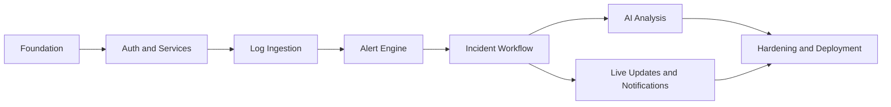

If time is limited, finish Phases 0–5 well. A polished, tested core is more valuable than many incomplete integrations.

---

## 21. Testing Strategy

### Test pyramid

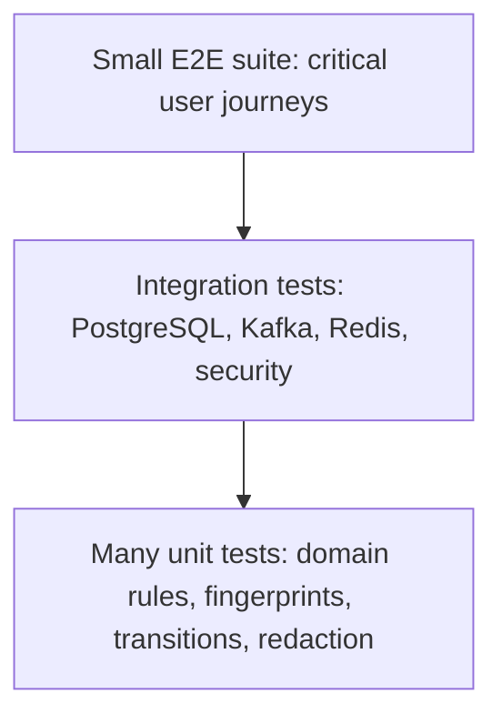

### Backend tests

- Unit: incident transition policy, severity validation, fingerprint normalization, threshold calculation, evidence ranking, redaction.
- MVC/API: validation, authorization, error format, pagination.
- Repository: indexes/queries and organization isolation.
- Integration: Testcontainers for PostgreSQL, Kafka, and Redis.
- Contract: event schema compatibility and LLM response schema.
- Concurrency: two users update the same incident and receive a clear conflict.
- Resilience: duplicate Kafka delivery, Redis unavailable, LLM timeout, poison message.

### Frontend tests

- Login/session refresh behavior
- Incident filters reflected in the URL
- Status transition form and validation
- Loading, empty, error, and permission states
- AI panel success/failure and evidence links
- Accessible labels and keyboard operation

### Critical end-to-end scenario

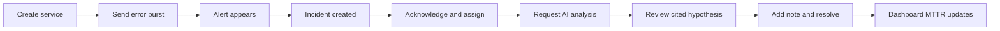

### Suggested initial performance targets

These are engineering goals, not guaranteed production SLAs:

- Ingestion API p95 under 200 ms while publishing asynchronously.
- Support 100–500 log events/second on a laptop demo environment.
- Alert visible within 5 seconds of a matching event.
- Incident list p95 under 500 ms for seeded demo data.
- AI analysis completes within 30 seconds or returns a visible failure.
- No duplicate incident for the same fingerprint within the configured correlation window.

---

## 22. CI/CD and Deployment

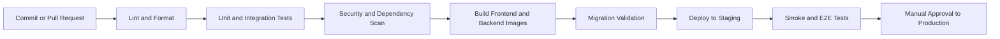

### Deployment progression

1. Local Docker Compose.
2. One staging VM or a simple container platform.
3. Managed PostgreSQL and Redis when possible.
4. Managed Kafka or a carefully operated cluster.
5. Only then consider Kubernetes/microservice extraction.

### Production considerations

- Back up PostgreSQL and test restore procedures.
- Run migrations as a controlled deployment step.
- Use readiness checks before accepting traffic.
- Use rolling or blue/green deployment.
- Pin container versions; do not use floating `latest` tags.
- Set CPU/memory limits and application timeouts.
- Configure retention for logs, audit records, and Kafka topics.
- Document rollback for application and database changes.

---

## 23. Common Mistakes to Avoid

- Starting with ten microservices before the domain works.
- Calling Kafka directly from React; all browser traffic should go through a secure backend API.
- Treating Redis as the permanent source of truth.
- Creating an incident for every matching log without fingerprinting/correlation.
- Persisting unlimited logs in PostgreSQL without retention/partitioning.
- Returning JPA entities directly from controllers.
- Putting long-lived JWTs in local storage without refresh rotation/revocation planning.
- Sending raw secrets or huge log dumps to an AI provider.
- Presenting AI output as a confirmed cause.
- Letting Kafka consumers produce duplicates on retries.
- Building the AI feature before the incident/evidence pipeline is reliable.
- Hiding failed background jobs instead of exposing a retryable state.

---

## 24. Definition of Done for the Whole Project

- [ ] A user can log in securely and permissions are enforced.
- [ ] An admin can register a monitored service and rotate its API key.
- [ ] A service can send validated logs asynchronously.
- [ ] Kafka consumers are idempotent and have dead-letter handling.
- [ ] Logs are searchable with bounded retention.
- [ ] Deterministic rules create deduplicated alerts.
- [ ] Related alerts correlate into incidents.
- [ ] Engineers can assign, acknowledge, investigate, note, resolve, and reopen incidents.
- [ ] All meaningful incident changes appear in the timeline/audit trail.
- [ ] The dashboard shows correct open counts, MTTA, and MTTR.
- [ ] AI analysis uses redacted, bounded evidence and cites evidence IDs.
- [ ] AI failures do not block normal incident handling.
- [ ] Unit, integration, and critical E2E tests pass in CI.
- [ ] The full environment starts from documented commands.
- [ ] No real credentials are committed.
- [ ] A seeded demo scenario works consistently.

---

## 25. Demo Story for Interviews

Prepare one repeatable five-minute demonstration:

1. Log in as an engineer and show healthy services.
2. Start the test generator that simulates a bad payment-service deployment.
3. Show database timeout logs arriving in the log explorer.
4. Show the threshold rule trigger one deduplicated SEV2 alert.
5. Open the automatically created incident and acknowledge it.
6. Request AI analysis and show the hypothesis tied to logs and the deployment event.
7. Add an investigation note, mark the incident mitigated, then resolve it.
8. Show the complete timeline and updated MTTR dashboard.
9. Briefly explain Kafka buffering, Redis deduplication, PostgreSQL truth, and AI guardrails.

This tells a coherent engineering story instead of displaying unrelated screens.

---

## 26. Learning Order for a Beginner

If some technologies are new, learn only what the next phase requires:

1. Java/Spring: controllers, services, dependency injection, validation, exceptions.
2. PostgreSQL/JPA: entities, relationships, migrations, transactions, indexes.
3. Spring Security/JWT: authentication versus authorization, filters, token expiry.
4. React: components, routing, forms, server state, error/loading states.
5. Kafka: topic, partition, producer, consumer group, offset, retry, idempotency.
6. Redis: TTL, counters, atomic operations, cache invalidation.
7. AI integration: evidence retrieval, structured output, redaction, evaluation.
8. Testing and deployment: Testcontainers, Docker, CI, observability.

Do not wait to master every technology before building. Implement a thin vertical slice, test it, and extend it.

---

## 27. The Best First Vertical Slice

Build this small path before the full platform:

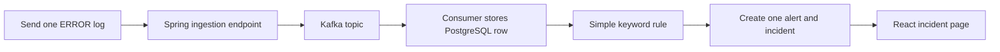

This slice proves that the main architecture works. After it works, add authentication, configurable rules, deduplication, workflow, dashboard metrics, and finally AI.

### First concrete coding tasks

1. Initialize the Spring Boot backend and React TypeScript frontend.
2. Add Docker Compose with PostgreSQL, Kafka, and Redis.
3. Add Flyway migration `V1__initial_schema.sql` for service, log, alert, and incident tables.
4. Implement `POST /api/v1/ingestion/logs` with a temporary development key.
5. Publish and consume `opsmind.raw-log-events.v1`.
6. Persist a log and create an alert when its level is `ERROR`.
7. Create an incident for the alert.
8. Implement `GET /api/v1/incidents` and display it in React.
9. Add one Testcontainers integration test for the complete path.
10. Replace the temporary key with full authentication in the next phase.

---

## 28. Final Architecture Decisions Summary

| Decision | Choice | Reason |
|---|---|---|
| Application shape | Modular monolith + Kafka workers | Lower operational complexity, clear future extraction path |
| Primary database | PostgreSQL | Strong transactions and flexible reporting |
| Recent log store | PostgreSQL for MVP | Simple learning setup; add specialist store at scale |
| Event transport | Kafka | Buffering, decoupling, ordered partitions, replay |
| Fast temporary state | Redis | Atomic counters, TTL dedup, cache, rate limiting |
| Browser authentication | Short access JWT + rotating refresh token | Practical stateless API access with revocation strategy |
| Rule strategy | Deterministic rules first | Explainable and testable |
| AI execution | Asynchronous, evidence-grounded worker | Keeps UI responsive and limits unsafe claims |
| Frontend data state | TanStack Query | Handles caching/refetch/error states cleanly |
| Schema management | Flyway | Reviewable and repeatable migrations |
| Integration testing | Testcontainers | Tests against real infrastructure behavior |

---

## 29. Success Criteria

OpsMind is successful when it is more than CRUD: a real event travels from a monitored service through Kafka, becomes a deduplicated alert and correlated incident, appears in a secure React workflow, gains an auditable human resolution, and can be analyzed by an AI assistant that clearly cites its evidence and uncertainty.

