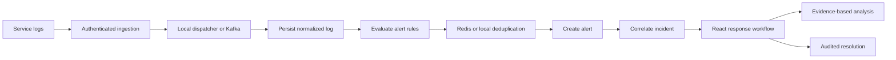

# OpsMind

OpsMind is a full-stack incident response platform built with Java 21, Spring Boot, React, PostgreSQL, Kafka, Redis, JWT authentication, and evidence-based AI-assisted analysis.



## What is implemented

- Signed short-lived JWT access tokens and rotating persisted refresh tokens
- BCrypt passwords, RBAC, hashed one-time ingestion keys, CORS, and validation
- Service catalog and API-key rotation
- Single/batch ingestion with unique external event IDs
- Local development transport and Kafka-backed production transport
- PostgreSQL/H2 persistence with Flyway migrations
- Keyword and count-threshold alert rules
- Redis-backed production deduplication and a local adapter
- Alert fingerprinting, incident correlation, lifecycle enforcement, notes, optimistic locking, and timeline
- Evidence-based local root-cause hypotheses with secret redaction and uncertainty labeling
- React dashboard, services, logs, rules, alerts, incidents, and response workspace
- OpenAPI/Swagger, Actuator, Dockerfiles, Compose, a demo generator, and automated tests

The local analyzer works without an external AI key. It can later be replaced with a hosted model adapter. The main incident workflow does not depend on an external provider.

## Structure

```text
backend/                     Spring Boot API and processors
frontend/                    React + TypeScript dashboard
infrastructure/              Docker Compose
scripts/                     Demo incident generator
OPSMIND_PROJECT_PLAN.md      Detailed architecture and roadmap
```

## Run locally without Docker

Prerequisites: Java 21+ and Node 22+.

Backend, from `backend` in PowerShell:

```powershell
$env:JAVA_HOME='C:\Program Files\Java\jdk-25.0.3'
& '..\.tools\apache-maven-3.9.11\bin\mvn.cmd' spring-boot:run
```

Frontend, from `frontend`:

```powershell
pnpm install
pnpm dev
```

Open <http://localhost:5173>. Demo accounts:

```text
admin@opsmind.local / Admin123!
engineer@opsmind.local / Engineer123!
```

Generate a complete incident from the repository root:

```powershell
.\scripts\generate-demo-incident.ps1
```

The local profile uses H2 and local Kafka/Redis adapters, so infrastructure is not required. The seeded ingestion key is `opm_demo_key`.

## Run the production topology

Copy `.env.example` to `.env`, replace all secrets, then run from `infrastructure`:

```powershell
docker compose up -d
docker compose --profile app up --build
```

The first command runs PostgreSQL, Redis, and Kafka. The second also builds the backend and frontend. Production mode does not seed accounts. Register the first admin via `POST /api/v1/auth/register`:

```powershell
$body = @{email='admin@example.com';password='replace-with-a-strong-password';displayName='Platform Admin'} | ConvertTo-Json
Invoke-RestMethod -Method Post -Uri 'http://localhost:8080/api/v1/auth/register' -ContentType 'application/json' -Body $body
```

## Test

Backend, from `backend`:

```powershell
$env:JAVA_HOME='C:\Program Files\Java\jdk-25.0.3'
& '..\.tools\apache-maven-3.9.11\bin\mvn.cmd' test
```

The backend integration suite boots Spring, applies Flyway, and verifies login, RBAC, service/key and rule creation, ingestion, automatic alert/incident creation, acknowledgment, notes, secret-redacted analysis, investigation, resolution, timeline, and negative cases.

Frontend, from `frontend`:

```powershell
pnpm test
pnpm build
```

Useful endpoints:

| URL | Purpose |
|---|---|
| `http://localhost:8080/swagger-ui.html` | Interactive API documentation |
| `http://localhost:8080/v3/api-docs` | OpenAPI JSON |
| `http://localhost:8080/actuator/health` | Health |
| `http://localhost:5173` | React application |

## Security and verification notes

- Replace `JWT_SECRET`, database credentials, and all sample credentials before shared deployment.
- Service API keys are shown once and stored as hashes. Refresh tokens are rotated and stored as hashes.
- Use HTTPS and a secret manager in production.
- The browser implementation uses session/local storage. A public production deployment should put refresh tokens in `HttpOnly`, `Secure`, `SameSite` cookies with the appropriate CSRF design.
- The complete Docker Compose topology has been validated with PostgreSQL, Kafka, Redis, the production Spring profile, and the Nginx-served React application. The verified flow covers registration, service/rule creation, Kafka ingestion, Redis deduplication, incident lifecycle changes, asynchronous analysis, secret redaction, and frontend health.

See [OPSMIND_PROJECT_PLAN.md](./OPSMIND_PROJECT_PLAN.md) for the complete design and diagrams.
